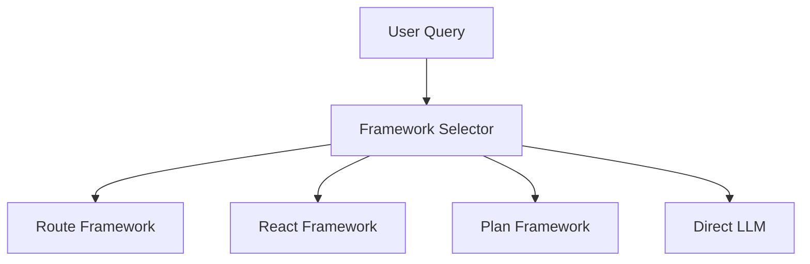
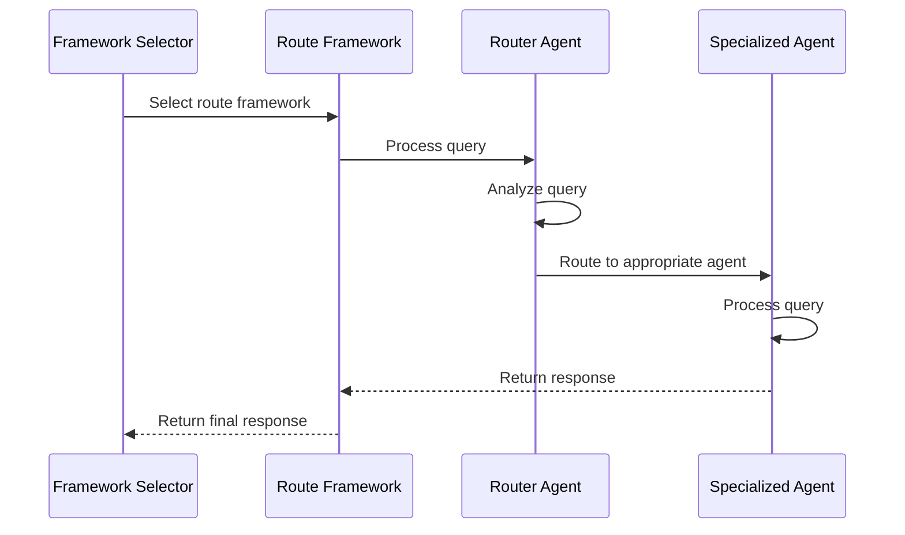
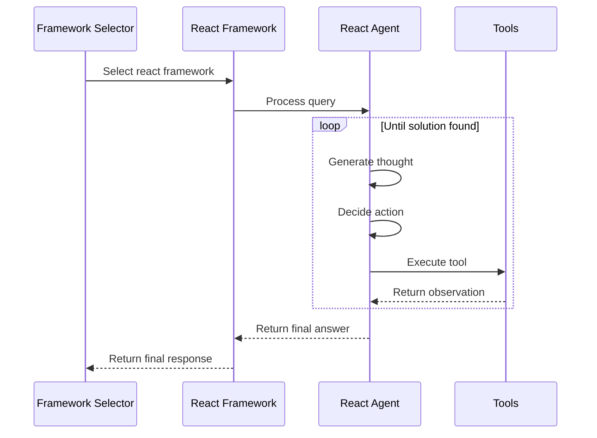
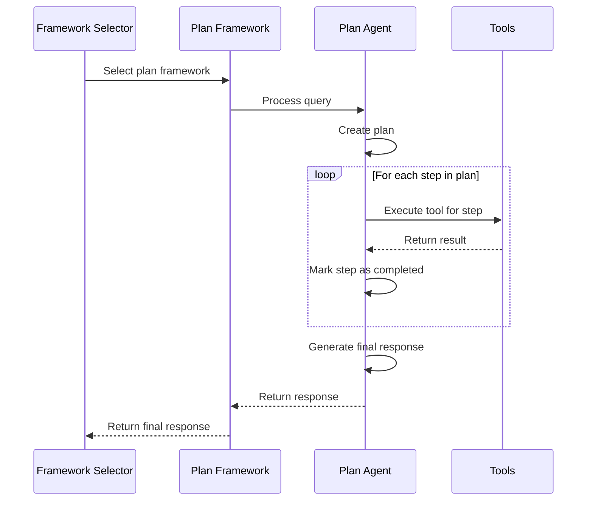
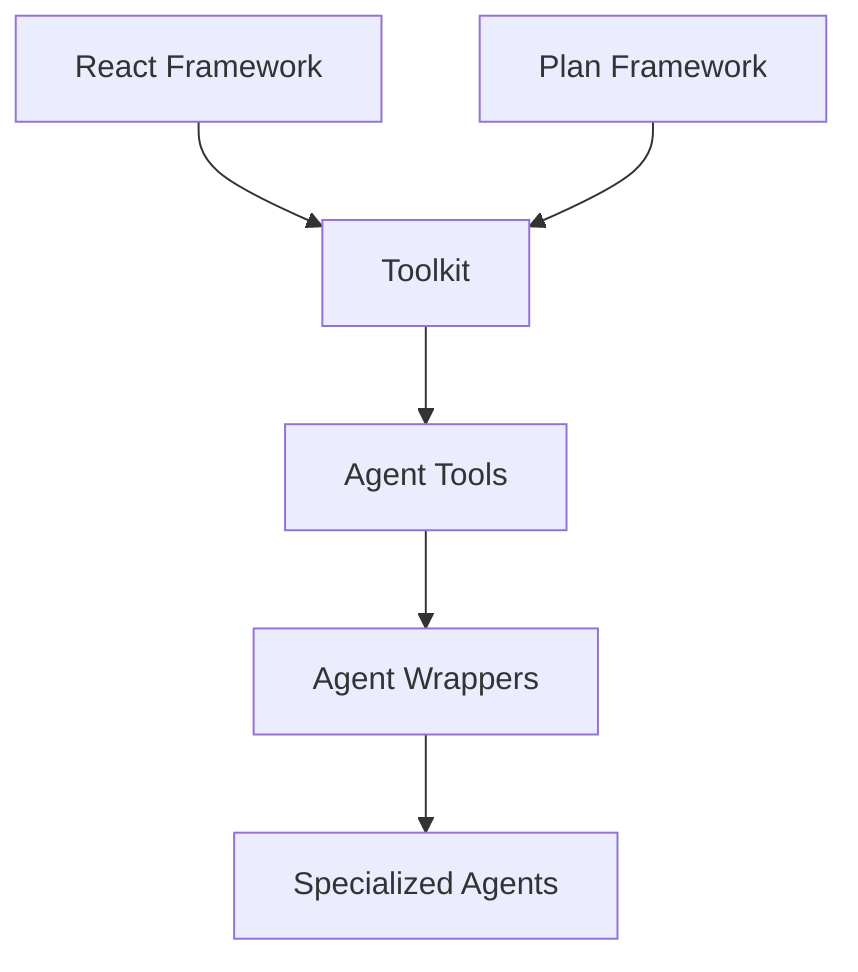
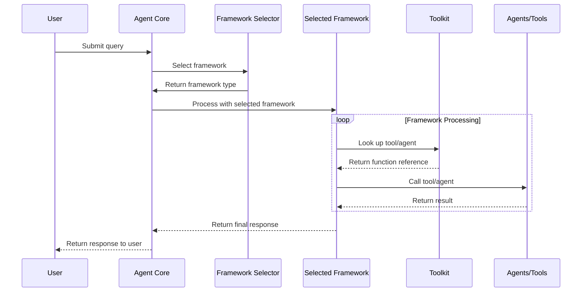

# How Agents are Invoked in the Framework System

The IronBox system uses a sophisticated architecture for invoking agents within different frameworks. Here's a detailed explanation of how this works:

## 1. Framework Selection Process

When a query enters the system, it first goes through the **Framework Selector**:



The Framework Selector analyzes the query and determines which framework is most appropriate:
- **Route Framework**: For simple, categorizable queries matching a specific agent's expertise
- **React Framework**: For multi-step problems requiring reasoning and tool usage
- **Plan Framework**: For complex problems requiring structured planning
- **Direct LLM**: For simple informational queries not requiring tools

## 2. Agent Invocation in Each Framework

### Route Framework



1. The Route Framework receives the query from the Framework Selector
2. It uses a Router Agent to analyze the query and determine which specialized agent should handle it
3. The appropriate specialized agent (e.g., ClusterInfoAgent, MemoryAgent) is invoked with the query
4. The specialized agent processes the query and returns a response
5. The response is returned through the framework

Code example from `LCRouteAgentFramework.process`:
```python
# Determine next agent
next_agent = None
for agent_name in self.agents.keys():
    if agent_name.lower() in response_text.lower():
        next_agent = agent_name
        break

# If we have a next agent and it's in our agents dictionary, call it
if next_agent and next_agent in self.agents:
    agent = self.agents[next_agent]
    state = await agent(state)
```

### React Framework



1. The React Framework receives the query from the Framework Selector
2. It creates a React Agent using the LangChain ReAct paradigm
3. The React Agent iteratively:
   - Generates a thought about the current state
   - Decides on an action to take
   - Executes a tool from the toolkit
   - Observes the result
   - Repeats until it reaches a solution
4. The final answer is returned through the framework

Code example from `LCReactAgentFramework.process`:
```python
# Create agent
agent = create_react_agent(self.llm, self.langchain_tools, prompt)

# Create agent executor
agent_executor = AgentExecutor(
    agent=agent,
    tools=self.langchain_tools,
    verbose=True,
    max_iterations=self.max_iterations,
    return_intermediate_steps=True,
)

# Execute agent
result = await agent_executor.ainvoke(inputs)
```

### Plan Framework



1. The Plan Framework receives the query from the Framework Selector
2. It first creates a detailed plan with specific steps
3. Then it executes each step in the plan:
   - For each step, it selects an appropriate tool
   - Executes the tool with the necessary input
   - Records the result
   - Marks the step as completed
4. After all steps are executed, it generates a final response
5. The response is returned through the framework

Code example from `LCPlanAgentFramework.process`:
```python
# Step 1: Create a plan
plan = await self._create_plan(state.input, tool_descriptions)

# Step 2: Execute the plan
results = await self._execute_plan(state.input, plan, tool_descriptions)

# Step 3: Generate final response
final_response = await self._generate_final_response(state.input, plan, results)
```

## 3. Agent Structure and Processing

Agents in the system follow a common pattern:

```python
class SomeAgent:
    def __init__(self, llm=default_llm):
        self.llm = llm
        self.system_prompt = "..."
    
    async def __call__(self, state: AgentState) -> AgentState:
        # Process the query
        # Update the state
        return state
```

Key aspects:
- Agents implement a `__call__` method that takes and returns an `AgentState`
- The `AgentState` contains the input query, chat history, and outputs from previous agents
- Agents update the state with their outputs and can specify the next agent to call
- The `current_agent` field in the state tracks which agent is currently processing

Example from `LLMAgent.__call__`:
```python
# Update state
state.current_agent = "llm"
state.agent_outputs["llm"] = {
    "response": response_text,
    "next": None,
}
```

## 4. Agent-as-Tool Wrapping

A key feature is the ability to use agents as tools in other frameworks:



1. When an agent is registered with the toolkit, a wrapper function is created
2. This wrapper function:
   - Takes a query and additional parameters
   - Creates a minimal agent state
   - Calls the agent with this state
   - Extracts and returns the response
3. The wrapper is registered as a tool that can be used by React and Plan frameworks

Code example from `Toolkit._create_agent_tool_wrapper`:
```python
async def agent_tool_wrapper(query: str, **kwargs):
    # Create a minimal state for the agent
    state = AgentState(input=query)
    
    # Add any additional kwargs to the state
    for key, value in kwargs.items():
        setattr(state, key, value)
    
    # Call the agent with the state
    agent_instance = agent()
    result_state = await agent_instance(state)
    
    # Extract and return the response
    if hasattr(result_state, 'agent_outputs') and agent_type in result_state.agent_outputs:
        return result_state.agent_outputs[agent_type].get("response", "No response from agent")
    return "Agent execution completed but no response was generated"
```

## 5. Complete Query Flow

The complete flow of a query through the system:



1. User submits a query to the Agent Core
2. Agent Core uses the Framework Selector to determine which framework to use
3. The selected framework processes the query:
   - Route Framework routes to specialized agents
   - React Framework uses the ReAct paradigm with tools
   - Plan Framework creates and executes a plan with tools
4. The framework uses the Toolkit to access tools and agents
5. The final response is returned to the user

## 6. LangGraph Integration

The system uses LangGraph for orchestration:

```python
# Create the graph
graph = StateGraph(AgentState)

# Add nodes for each framework
for name, framework in self.frameworks.items():
    graph.add_node(name, framework.process)

# Add framework selector as the entry point
graph.set_entry_point("framework_selector")

# Define conditional routing
graph.add_conditional_edges(
    "framework_selector",
    lambda state, condition=condition: eval(condition),
    {
        True: to_node,
        False: END
    }
)
```

This creates a directed graph where:
- Each framework is a node in the graph
- The Framework Selector is the entry point
- Conditional edges determine which framework processes the query
- The state flows through the graph until it reaches an END node

This architecture provides a flexible and powerful system for processing queries, with the ability to select the most appropriate framework and tools for each query.
