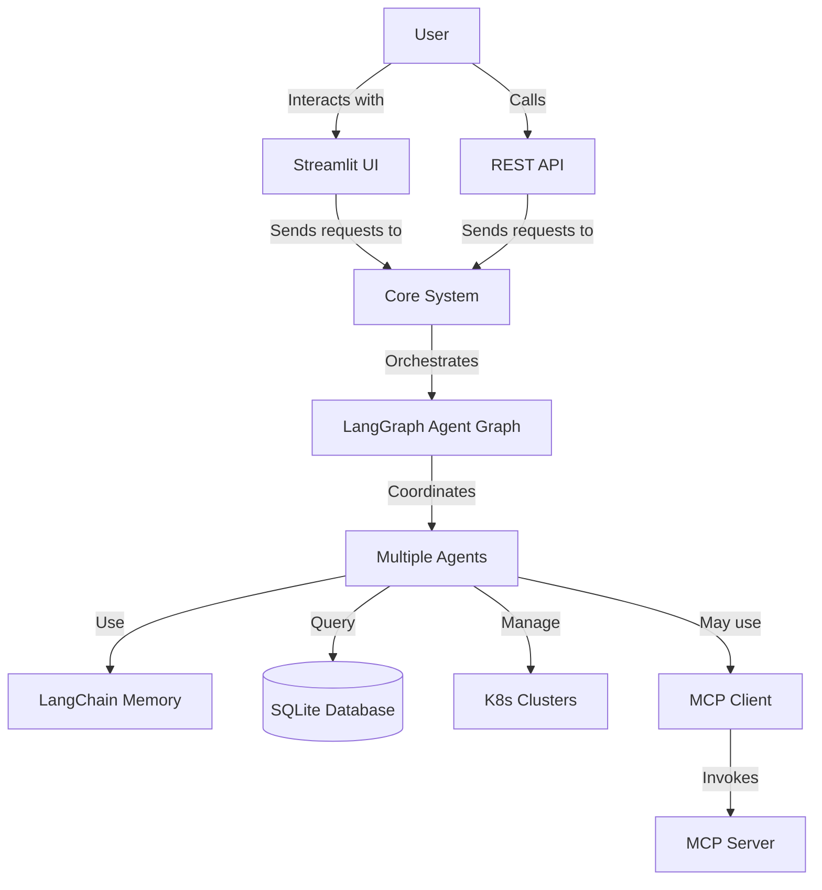
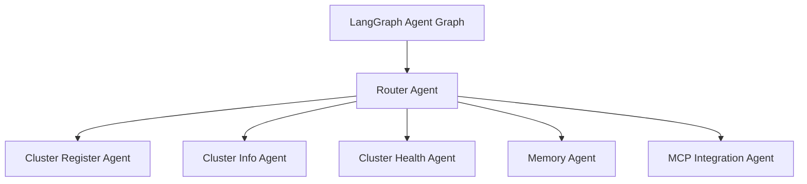

# IronBox Design Document

## 1. Executive Summary

### Project Overview
IronBox is a multi-agent platform designed for Kubernetes cluster management. It leverages LangGraph for agent orchestration, allowing for extensible functionality through a modular agent architecture. The system provides a comprehensive solution for managing multiple Kubernetes clusters, monitoring their health, and interacting with them through natural language.

### Key Features and Benefits
- **Multi-Agent Architecture**: Specialized agents for different tasks
- **K8s Cluster Management**: Register and manage multiple Kubernetes clusters
- **Health Analysis**: Monitor pod status, resource usage, and PVC/Volume health
- **Memory System**: Retain context and parameters across conversations
- **Extensible Framework**: Add new agents and capabilities
- **MCP Integration**: Use Model Context Protocol for tool integration
- **User Interfaces**: REST API and Streamlit UI

### Target Use Cases
- DevOps teams managing multiple Kubernetes clusters
- System administrators monitoring cluster health
- Development teams deploying applications to Kubernetes
- Organizations with complex Kubernetes infrastructure

## 2. Architecture Overview

### High-level Architecture Diagram



### Component Interactions
The system follows a layered architecture:
1. **User Interface Layer**: Streamlit UI and REST API
2. **Core Layer**: LangGraph orchestration, agent management
3. **Agent Layer**: Specialized agents for different tasks
4. **Integration Layer**: Kubernetes client, MCP client
5. **Storage Layer**: SQLite database for persistence

### Technology Stack
- **Python**: Core programming language
- **LangGraph**: Agent orchestration framework
- **LangChain**: Memory and LLM integration
- **Kubernetes Python Client**: Official client for K8s management
- **FastAPI**: REST API framework
- **Streamlit**: UI framework
- **SQLite**: Database for storing cluster information and chat history
- **Ollama**: Default LLM provider (configurable)
- **MCP SDK**: Model Context Protocol integration

### System Requirements
- Python 3.9+
- Access to Kubernetes clusters
- Ollama server (default) or other LLM provider
- Sufficient disk space for SQLite database
- Network access to Kubernetes API servers

## 3. Component Design

### 3.1 Core System

#### LLM Interface Specifications
The LLM interface is designed to be modular and configurable:
- Default implementation uses Ollama
- Custom `OllamaChat` class implements the LangChain `BaseChatModel` interface
- Factory pattern for creating different LLM implementations
- Configuration via environment variables or config file

```python
class OllamaChat(BaseChatModel):
    """Chat model implementation for Ollama."""
    
    client: Ollama
    model_name: str
    temperature: float
    max_tokens: int
    
    # Implementation details...
```

#### Memory System Design
The memory system uses LangChain's memory components with SQLite persistence:
- `SQLiteMemory` extends `ConversationBufferMemory`
- `FunctionMemory` for storing function call parameters
- `MemoryManager` for coordinating different memory types
- Session-based memory for multi-user support

```python
class MemoryManager:
    """Manager for conversation and function memory."""
    
    def __init__(self, session_id: Optional[str] = None, db_session: Optional[AsyncSession] = None):
        self.session_id = session_id or str(uuid.uuid4())
        self.db_session = db_session
        self.conversation_memory = SQLiteMemory(session_id=self.session_id, db_session=self.db_session)
        self.function_memory = FunctionMemory(session_id=self.session_id, db_session=self.db_session)
    
    # Implementation details...
```

#### Database Schema
The database schema includes the following tables:
- `clusters`: Stores Kubernetes cluster information
- `cluster_health_checks`: Stores health check results
- `chat_history`: Stores conversation history
- `function_calls`: Stores function call parameters and results

```python
class Cluster(Base):
    """Model for Kubernetes cluster information."""
    __tablename__ = "clusters"
    
    id = Column(Integer, primary_key=True)
    name = Column(String(100), nullable=False, unique=True)
    api_server = Column(String(255), nullable=False)
    # Additional fields...
```

#### Configuration Management
Configuration is managed through a hierarchical system:
- Default configuration in code
- Environment variables for overrides
- Optional configuration file for advanced settings
- Runtime configuration for dynamic changes

```python
# Default configuration
DEFAULT_CONFIG = {
    "llm": {
        "provider": "ollama",
        "base_url": os.getenv("OLLAMA_BASE_URL", "http://192.168.0.103:11434"),
        "model": os.getenv("OLLAMA_MODEL", "qwen2.5"),
        # Additional settings...
    },
    # Other configuration sections...
}
```

### 3.2 Agent Framework

#### Agent Types and Responsibilities



- **Router Agent**: Analyzes user input and routes to specialized agents
- **Cluster Register Agent**: Handles cluster registration and connection testing
- **Cluster Info Agent**: Provides information about registered clusters
- **Cluster Health Agent**: Analyzes cluster health and reports issues
- **Memory Agent**: Retrieves information from conversation history
- **MCP Agent**: Interacts with MCP servers for external tools

#### Router Agent Design
The Router Agent is the entry point for all user requests:
- Analyzes user input using LLM
- Determines the appropriate specialized agent
- Routes the request to the selected agent
- Handles fallback when no specialized agent is appropriate

```python
class RouterAgent:
    """Router agent for directing requests to specialized agents."""
    
    def __init__(self, llm=default_llm):
        self.llm = llm
        self.system_prompt = """
        You are a router agent for the IronBox system. Your job is to analyze the user's request and determine which specialized agent should handle it.
        
        Available agents:
        - cluster_register: For registering new Kubernetes clusters
        - cluster_info: For getting information about registered clusters
        - cluster_health: For checking the health of clusters
        - memory: For retrieving information from memory
        - mcp: For using MCP tools
        
        Respond with the name of the agent that should handle the request.
        """
    
    # Implementation details...
```

#### Agent State Management
Agent state is managed through the `AgentState` class:
- Stores input from user
- Tracks chat history
- Maintains current agent
- Collects agent outputs
- Handles error information

```python
class AgentState(BaseModel):
    """State for agent graph."""
    
    # Input from user
    input: str = Field(default="")
    
    # Chat history
    chat_history: List[Dict[str, str]] = Field(default_factory=list)
    
    # Current agent
    current_agent: Optional[str] = Field(default=None)
    
    # Agent outputs
    agent_outputs: Dict[str, Any] = Field(default_factory=dict)
    
    # Final response
    response: Optional[str] = Field(default=None)
    
    # Error information
    error: Optional[str] = Field(default=None)
```

#### Extension Mechanisms
The agent framework is designed for extensibility:
- New agents can be added by implementing the agent interface
- Agents are registered in the agent graph
- Router agent can be updated to route to new agents
- Configuration can be extended for new agent types

### 3.3 LangGraph Orchestration

#### Graph Definition
The agent graph is defined using LangGraph:
- Nodes represent agents
- Edges represent transitions between agents
- Router agent is the entry point
- Conditional routing based on agent outputs

```python
def _build_graph(self) -> StateGraph:
    """
    Build the agent graph.
    
    Returns:
        StateGraph instance
    """
    # Create the graph
    graph = StateGraph(AgentState)
    
    # Add nodes for each agent
    for agent_name, agent in self.agents.items():
        graph.add_node(agent_name, agent)
    
    # Add router as the entry point
    graph.set_entry_point(AgentType.ROUTER)
    
    # Define conditional routing
    graph.add_conditional_edges(
        AgentType.ROUTER,
        self._route_from_router,
    )
    
    # Add edges from other agents back to router or to end
    for agent_name in self.agents.keys():
        if agent_name != AgentType.ROUTER:
            graph.add_conditional_edges(
                agent_name,
                self._route_from_agent,
            )
    
    # Compile the graph
    return graph.compile()
```

#### State Transitions
State transitions are managed through conditional routing:
- Router agent determines the next agent
- Specialized agents can specify the next agent or return to router
- End state is reached when no next agent is specified

```python
def _route_from_router(self, state: AgentState) -> str:
    """
    Route from router agent.
    
    Args:
        state: Current state
        
    Returns:
        Next agent name or END
    """
    # Get the next agent from router output
    agent_outputs = state.agent_outputs
    if AgentType.ROUTER not in agent_outputs:
        return END
    
    router_output = agent_outputs[AgentType.ROUTER]
    next_agent = router_output.get("next")
    
    # Check if next agent is valid
    if next_agent and next_agent in self.agents:
        return next_agent
    
    # If no valid next agent, end the graph
    return END
```

#### Error Handling
Error handling is implemented at multiple levels:
- Agent-level error handling for specific errors
- Graph-level error handling for general errors
- Fallback mechanisms for unexpected situations
- Error reporting to the user

### 3.4 K8s Integration

#### Kubernetes Client Implementation
The Kubernetes client is implemented using the official Kubernetes Python client:
- Supports multiple authentication methods (token, certificate, config file)
- Handles connection testing and error reporting
- Provides methods for cluster information retrieval
- Implements health check functionality

```python
class KubernetesClient:
    """Client for interacting with Kubernetes clusters."""
    
    def __init__(
        self,
        api_server: Optional[str] = None,
        token: Optional[str] = None,
        certificate: Optional[str] = None,
        config_file: Optional[str] = None,
        config_context: Optional[str] = None,
        insecure_skip_tls_verify: bool = False,
        timeout: int = app_config["kubernetes"]["default_timeout"]
    ):
        # Initialization...
    
    def connect(self) -> bool:
        """Connect to the Kubernetes cluster."""
        # Implementation...
    
    def get_cluster_info(self) -> Dict[str, Any]:
        """Get cluster information."""
        # Implementation...
    
    def get_health_check(self, namespace: Optional[str] = None) -> Dict[str, Any]:
        """Get comprehensive health check."""
        # Implementation...
```

#### Cluster Registration Workflow
The cluster registration workflow includes:
1. Extracting cluster information from user input
2. Validating the information
3. Testing the connection to the cluster
4. Storing the cluster information in the database
5. Providing feedback to the user

#### Authentication Mechanisms
Multiple authentication mechanisms are supported:
- Token-based authentication
- Certificate-based authentication
- Kubeconfig file-based authentication
- In-cluster authentication (for running inside a cluster)

#### Health Monitoring Approach
Health monitoring includes:
- Pod status checking (Running, Pending, Failed, etc.)
- Resource usage monitoring (CPU, memory)
- Storage health analysis (PVC/Volume status)
- Issue detection and severity assessment
- Historical health data tracking

### 3.5 MCP Integration

#### MCP Client Design
The MCP client is designed to interact with MCP servers:
- Supports multiple MCP servers
- Handles server discovery and connection
- Provides methods for tool and resource access
- Implements error handling and fallback mechanisms

```python
class MCPClient:
    """Client for interacting with MCP servers."""
    
    def __init__(self, servers_config: Optional[Dict[str, Any]] = None):
        self.servers_config = servers_config or config["mcp"]["servers"]
        self.servers = {}
        self.enabled = config["mcp"]["enabled"]
    
    async def initialize(self):
        """Initialize MCP client."""
        # Implementation...
    
    async def list_servers(self) -> List[Dict[str, Any]]:
        """List available MCP servers."""
        # Implementation...
    
    async def use_tool(self, server_name: str, tool_name: str, arguments: Dict[str, Any]) -> Any:
        """Use a tool."""
        # Implementation...
```

#### Demo Server Implementation
A weather MCP server is implemented as a demonstration:
- Provides weather information for cities
- Implements the MCP protocol
- Offers tools for current weather and forecasts
- Provides resources for city information

```python
class WeatherServer:
    """Weather MCP server."""
    
    def __init__(self):
        self.cities = {
            "new york": {
                "country": "United States",
                "latitude": 40.7128,
                "longitude": -74.0060,
            },
            # Other cities...
        }
        
        self.weather_conditions = [
            "Clear",
            "Partly Cloudy",
            # Other conditions...
        ]
    
    async def handle_request(self, request: Dict[str, Any]) -> Dict[str, Any]:
        """Handle an MCP request."""
        # Implementation...
```

#### Tool and Resource Definitions
MCP tools and resources are defined with clear schemas:
- Tools have input schemas and descriptions
- Resources have URIs and MIME types
- Resource templates support parameterized URIs
- Error handling for invalid inputs

#### Integration Patterns
MCP integration is implemented through the MCP agent:
- Analyzes user requests for MCP operations
- Routes requests to appropriate MCP servers
- Handles tool invocation and resource access
- Formats responses for the user

### 3.6 API Layer

#### Endpoint Specifications
The API layer includes the following endpoints:
- `/chat`: For chat interactions
- `/clusters`: For cluster management
- `/clusters/{cluster_id}`: For specific cluster operations
- `/clusters/{cluster_id}/health`: For health checks
- `/health`: For API health checking

```python
@router.post("/chat", response_model=ChatResponse)
async def chat(
    request: ChatRequest,
    db: AsyncSession = Depends(get_db_session),
):
    """Chat with the assistant."""
    # Implementation...

@router.post("/clusters", response_model=ClusterResponse)
async def create_cluster(
    request: ClusterRequest,
    db: AsyncSession = Depends(get_db_session),
):
    """Create a new cluster."""
    # Implementation...
```

#### Request/Response Formats
Request and response formats are defined using Pydantic models:
- `ChatRequest` and `ChatResponse` for chat interactions
- `ClusterRequest` and `ClusterResponse` for cluster operations
- `HealthCheckResponse` for health check results
- Error responses for error handling

```python
class ChatRequest(BaseModel):
    """Chat request model."""
    
    message: str = Field(..., description="User message")
    session_id: Optional[str] = Field(None, description="Chat session ID")


class ChatResponse(BaseModel):
    """Chat response model."""
    
    response: str = Field(..., description="Assistant response")
    session_id: str = Field(..., description="Chat session ID")
```

#### Error Handling
Error handling in the API layer includes:
- HTTP status codes for different error types
- Detailed error messages for debugging
- Graceful handling of database errors
- Fallback mechanisms for unexpected errors

#### Rate Limiting
Rate limiting is implemented to prevent abuse:
- Per-endpoint rate limits
- Per-user rate limits
- Configurable rate limit settings
- Rate limit headers in responses

### 3.7 UI Design

#### Screen Mockups

**Chat Interface:**
```
+-----------------------------------------------+
|                   IronBox                     |
+---------------+-------------------------------+
|               |                               |
| Navigation    |  Chat with IronBox            |
|               |                               |
| [Chat]        |  User: Register a new cluster |
| [Clusters]    |                               |
|               |  Assistant: I'll help you     |
|               |  register a new cluster.      |
|               |  Please provide the following |
|               |  information:                 |
|               |  - Cluster name               |
|               |  - API server URL             |
|               |  - Authentication method      |
|               |                               |
|               |  User: _                      |
|               |                               |
+---------------+-------------------------------+
```

**Clusters List:**
```
+-----------------------------------------------+
|                   IronBox                     |
+---------------+-------------------------------+
|               |                               |
| Navigation    |  Kubernetes Clusters          |
|               |                               |
| [Chat]        |  🟢 production-cluster        |
| [Clusters]    |     API: https://prod:6443    |
|               |     Status: healthy           |
|               |     [View] [Health] [Delete]  |
|               |                               |
|               |  🟠 staging-cluster           |
|               |     API: https://staging:6443 |
|               |     Status: warning           |
|               |     [View] [Health] [Delete]  |
|               |                               |
|               |  Register New Cluster         |
|               |  [Form fields...]             |
|               |                               |
+---------------+-------------------------------+
```

**Cluster Health:**
```
+-----------------------------------------------+
|                   IronBox                     |
+---------------+-------------------------------+
|               |                               |
| Navigation    |  Health Check: prod-cluster   |
|               |                               |
| [Chat]        |  Status: 🟢 healthy           |
| [Clusters]    |                               |
|               |  Pod Status                   |
|               |  [Pie chart of pod statuses]  |
|               |  Total Pods: 45               |
|               |                               |
|               |  Resource Usage               |
|               |  [CPU gauge: 37.5%]           |
|               |  [Memory gauge: 25.0%]        |
|               |                               |
|               |  Storage Status               |
|               |  [PVC status chart]           |
|               |  [PV status chart]            |
|               |                               |
+---------------+-------------------------------+
```

#### User Workflows
1. **Cluster Registration Workflow:**
   - Navigate to Clusters page
   - Fill in cluster registration form
   - Submit form
   - View cluster details
   - Check cluster health

2. **Chat Interaction Workflow:**
   - Navigate to Chat page
   - Ask question about clusters
   - Receive response from assistant
   - Follow up with additional questions
   - Execute commands through chat

3. **Health Check Workflow:**
   - Navigate to Clusters page
   - Select a cluster
   - Click "Check Health" button
   - View health check results
   - Investigate any issues

#### Component Hierarchy
The UI is organized into a hierarchy of components:
- App container
- Navigation sidebar
- Page components (Chat, Clusters, Cluster Details, Health Check)
- Form components (Cluster Registration)
- Visualization components (Charts, Gauges)
- Interactive components (Buttons, Inputs)

#### Responsive Design Considerations
The UI is designed to be responsive:
- Fluid layout that adapts to different screen sizes
- Mobile-friendly navigation
- Responsive charts and visualizations
- Accessible design for all users

## 4. Data Flow

### Request Processing Pipeline
1. User submits request through UI or API
2. Request is processed by FastAPI handler
3. Request is passed to agent graph
4. Router agent determines appropriate specialized agent
5. Specialized agent processes request
6. Result is returned to user

### Agent Communication Patterns
Agents communicate through the agent graph:
- Router agent directs requests to specialized agents
- Specialized agents can return to router or end processing
- Agents can access shared state through the agent state object
- Agents can communicate with external systems (K8s, MCP)

### Memory Persistence
Memory is persisted through the SQLite database:
- Conversation history is stored in the `chat_history` table
- Function calls are stored in the `function_calls` table
- Memory is associated with session IDs for multi-user support
- Memory can be retrieved and used for context in future interactions

### Database Interactions
Database interactions are managed through SQLAlchemy:
- Async database operations for non-blocking I/O
- Transaction management for data consistency
- Error handling for database failures
- Connection pooling for performance

## 5. Security Considerations

### Data Protection
Data protection measures include:
- Sensitive data (tokens, certificates) are stored securely
- Database encryption for sensitive data
- Secure handling of Kubernetes credentials
- No persistent storage of sensitive data unless necessary

### Future Authentication Options
Future authentication options could include:
- User authentication for API and UI
- Role-based access control for different operations
- OAuth integration for single sign-on
- API key authentication for programmatic access

### Secure Communication
Secure communication is ensured through:
- HTTPS for API and UI
- Secure connections to Kubernetes API servers
- Validation of certificates for TLS connections
- Proper handling of authentication tokens

## 6. Testing Strategy

### Unit Testing Approach
Unit tests focus on individual components:
- Agent functionality testing
- Database operations testing
- Kubernetes client testing
- MCP client testing
- Utility function testing

```python
@pytest.mark.asyncio
async def test_cluster_register_agent(mock_llm, mock_k8s_client, db_session):
    """Test the cluster register agent."""
    with patch("ironbox.agents.cluster_register.KubernetesClient", return_value=mock_k8s_client):
        # Create cluster register agent
        agent = ClusterRegisterAgent(llm=mock_llm, db_session=db_session)
        
        # Create agent state
        state = AgentState(input="Register a new cluster named test-cluster with API server https://test-cluster:6443")
        
        # Call agent
        result = await agent(state)
        
        # Check result
        assert AgentType.CLUSTER_REGISTER in result.agent_outputs
        assert "response" in result.agent_outputs[AgentType.CLUSTER_REGISTER]
        assert "test-cluster" in result.agent_outputs[AgentType.CLUSTER_REGISTER]["response"]
```

### Integration Testing
Integration tests focus on component interactions:
- API endpoint testing
- Agent graph testing
- Database integration testing
- Kubernetes integration testing
- MCP integration testing

```python
@patch("ironbox.agents.cluster_register.KubernetesClient")
def test_create_cluster(mock_kubernetes_client, mock_k8s_client):
    """Test the create cluster endpoint."""
    # Set up mocks
    mock_kubernetes_client.return_value = mock_k8s_client
    
    # Test create cluster endpoint
    response = client.post(
        "/clusters",
        json={
            "name": "test-cluster",
            "api_server": "https://test-cluster:6443",
            "description": "Test cluster",
            "token": "test-token",
            "insecure_skip_tls_verify": True,
        },
    )
    
    assert response.status_code == 200
    assert response.json()["name"] == "test-cluster"
    assert response.json()["api_server"] == "https://test-cluster:6443"
    assert response.json()["description"] == "Test cluster"
```

### Performance Testing
Performance testing focuses on system performance:
- Response time testing
- Throughput testing
- Database performance testing
- Memory usage testing
- CPU usage testing

### Test Coverage Goals
Test coverage goals include:
- 80%+ code coverage for core components
- 90%+ code coverage for critical components
- All API endpoints tested
- All agent types tested
- All database operations tested

## 7. Deployment Guide

### Environment Setup
Environment setup includes:
- Python 3.9+ installation
- Virtual environment creation
- Dependency installation
- Database initialization
- Configuration file setup

```bash
# Create virtual environment
python -m venv venv
source venv/bin/activate  # On Windows: venv\Scripts\activate

# Install dependencies
pip install -e .

# Initialize database
python -m ironbox.db.operations
```

### Configuration Options
Configuration options include:
- LLM provider and settings
- Database connection settings
- API server settings
- UI settings
- Kubernetes client settings
- MCP server settings

```
# .env file example
OLLAMA_BASE_URL=http://localhost:11434
OLLAMA_MODEL=qwen2.5
API_HOST=0.0.0.0
API_PORT=8000
UI_PORT=8501
```

### Scaling Considerations
Scaling considerations include:
- Horizontal scaling of API servers
- Database scaling for high load
- Load balancing for distributed deployment
- Caching for improved performance
- Asynchronous processing for long-running tasks

### Monitoring Recommendations
Monitoring recommendations include:
- API server monitoring
- Database monitoring
- LLM service monitoring
- Kubernetes client monitoring
- Error rate monitoring
- Response time monitoring

## 8. Future Extensions

### Potential New Agent Types
Potential new agent types include:
- Deployment Agent: For deploying applications to Kubernetes
- Monitoring Agent: For advanced monitoring of clusters
- Troubleshooting Agent: For diagnosing and fixing issues
- Backup Agent: For managing cluster backups
- Security Agent: For security scanning and hardening

### Additional MCP Integrations
Additional MCP integrations could include:
- Git Operations: For managing infrastructure as code
- Cloud Providers: For managing cloud resources
- CI/CD Systems: For integration with deployment pipelines
- Monitoring Systems: For advanced monitoring
- Security Scanners: For security analysis

### Performance Optimizations
Performance optimizations could include:
- Caching of frequently used data
- Parallel processing of agent tasks
- Optimized database queries
- Efficient LLM prompt design
- Resource-aware scheduling

### UI Enhancements
UI enhancements could include:
- Advanced visualization of cluster health
- Interactive cluster topology diagrams
- Real-time updates of cluster status
- Customizable dashboards
- Mobile application support
