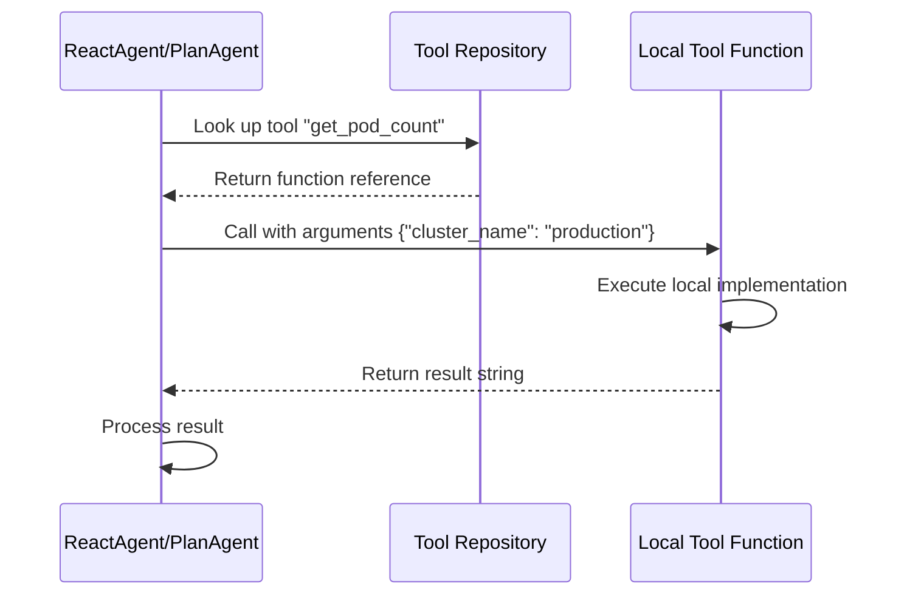
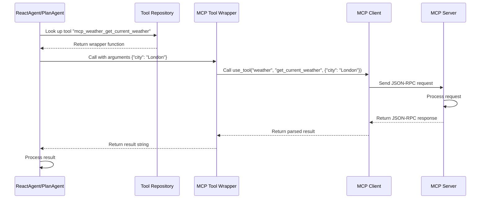
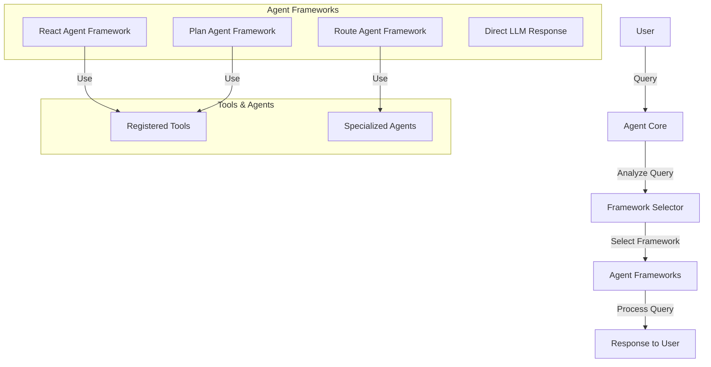
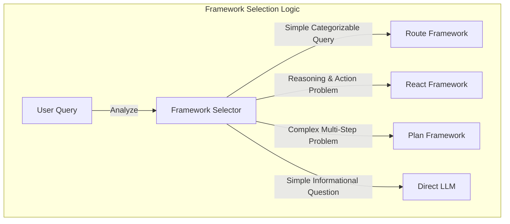
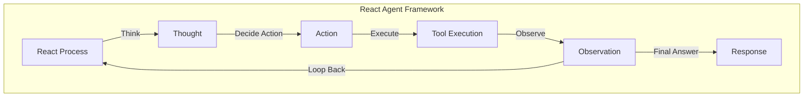
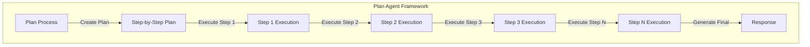
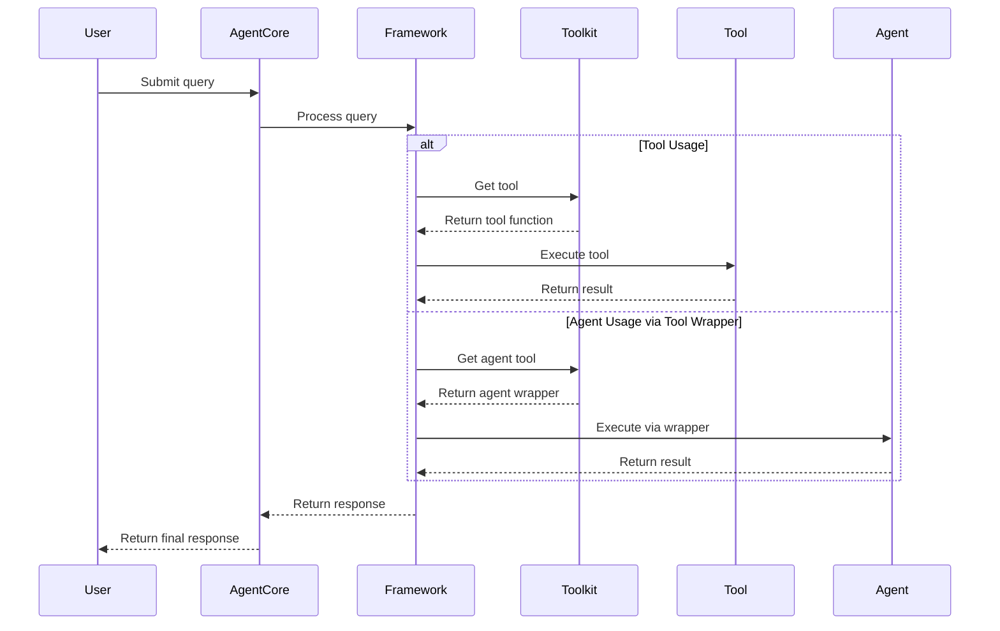

# Enhanced Architecture Q&A

This document captures the questions and answers related to the enhanced multi-agent architecture implementation for IronBox.

## Core Design Enhancement

**Question:**
> Your route agent is ok, but we often solve cluster issues, it's like solving a logical problem. Could you please enhance current core design:
> - reserve current route agent design
> - provide other frameworks like ReactAgent, PlanAgent 
> - plan agent framework can plan a step before action, and then step to step solve user query
> - each kind of framework can solve different kind of problem
> - the core design can decide which kind of framework we can use according to user query type
> - if no need to invoke agent or tools, core can send query to LLM to get response directly

**Answer:**
We've implemented an enhanced architecture that meets all these requirements:

1. **Preserved Route Agent**: The original route agent design is maintained as `RouteAgentFramework`
2. **Multiple Frameworks**: Added `ReactAgentFramework` and `PlanAgentFramework`
3. **Planning Capability**: `PlanAgentFramework` creates a plan before execution
4. **Framework Selection**: Added a `FrameworkSelector` that chooses the appropriate framework based on query type
5. **Direct LLM Response**: Added capability to bypass frameworks for simple queries

The implementation includes:
- A base `AgentFramework` abstract class
- Three concrete framework implementations
- A unified `AgentCore` that manages framework selection and execution
- Integration with both local and MCP tools

## Framework Selection Logic

The system automatically selects the appropriate framework based on the query type:
- Simple categorizable queries → Route Framework
- Reasoning and action problems → React Framework
- Complex multi-step problems → Plan Framework
- Simple informational questions → Direct LLM Response

## Tool Repository Integration

**Question:**
> How does the framework call the tools which are in the tools repository?

**Answer:**
The Tool Repository in our enhanced architecture can register and use tools from two sources:

1. **Local tools** - defined within the application
2. **MCP tools** - provided by external MCP servers

### Local Tools Integration

Local tools are defined as Python functions within the application and registered directly with the agent core:

```python
# Define a local tool function
async def get_pod_count(cluster_name: str) -> str:
    """Get the number of pods in a cluster."""
    # Implementation that interacts with Kubernetes API
    from ironbox.util.kubernetes_client import KubernetesClient
    
    client = KubernetesClient(cluster_name=cluster_name)
    pods = await client.list_pods()
    return f"Cluster {cluster_name} has {len(pods)} pods."

# Register the tool
agent_core.register_tool("get_pod_count", get_pod_count)
```

### MCP Tools Integration

MCP tools are provided by external MCP servers and accessed through the MCP client:

```python
# Define an MCP tool wrapper
async def mcp_get_weather(city: str, units: str = "celsius") -> str:
    """Get current weather for a city using the weather MCP server."""
    from ironbox.mcp.client import default_mcp_client
    
    try:
        # Call the MCP tool
        result = await default_mcp_client.use_tool(
            server_name="weather",
            tool_name="get_current_weather",
            arguments={
                "city": city,
                "units": units
            }
        )
        return result
    except Exception as e:
        return f"Error getting weather: {str(e)}"
```

### Tool Invocation Flow

The frameworks (particularly ReactAgentFramework and PlanAgentFramework) call tools from the tools repository through a well-defined process:



For MCP tools, the flow is similar but includes an additional layer:



### Automatic Tool Registration

The system can automatically discover and register MCP tools:

```python
async def register_mcp_tools(self):
    """Register MCP tools with the agent core."""
    # Initialize MCP client
    await default_mcp_client.initialize()
    
    # Get list of servers
    servers = await default_mcp_client.list_servers()
    
    for server in servers:
        server_name = server["name"]
        
        # Get tools for this server
        tools = await default_mcp_client.list_tools(server_name)
        
        for tool in tools:
            tool_name = tool["name"]
            
            # Create a wrapper function for this tool
            async def mcp_tool_wrapper(**kwargs):
                return await default_mcp_client.use_tool(
                    server_name=server_name,
                    tool_name=tool_name,
                    arguments=kwargs
                )
            
            # Register the wrapper
            agent_core.register_tool(f"mcp_{server_name}_{tool_name}", mcp_tool_wrapper)
```

## Architecture Diagrams

### Overall Architecture



### Framework Selection Logic



### React Framework



### Plan Framework



## Implementation Details

The implementation consists of several key files:

1. **ironbox/core/agent_framework.py**: Defines the base framework class and implementations
2. **ironbox/core/agent_core.py**: Provides the main entry point for processing queries
3. **ironbox/api/routes.py**: Registers local tools and agents
4. **ironbox/api/server.py**: Initializes the agent core during startup
5. **ironbox/tests/test_enhanced_architecture.py**: Demonstrates and tests the new architecture

## Benefits of the Enhanced Architecture

1. **More Effective Problem Solving**: Different frameworks for different problem types
2. **Logical Problem Solving**: Plan framework excels at solving complex logical problems
3. **Flexibility**: Easy to extend with new tools, agents, and frameworks
4. **Unified Interface**: Consistent access to both local and external tools
5. **Automatic Framework Selection**: Intelligent routing based on query type
6. **Agent-as-Tool Pattern**: Ability to use specialized agents as tools in any framework
7. **Configuration-Driven Setup**: Tools and agents can be configured through YAML files
8. **Auto-Discovery**: Automatic discovery of tools and agents based on conventions

## Unified Toolkit Architecture

**Question:**
> The current architecture has separate tools and agents. Could we have a unified toolkit that allows all frameworks to access both tools and agents?

**Answer:**
We've implemented a unified toolkit architecture that addresses this requirement:

1. **Toolkit Class**: A central repository for all tools and agents
2. **Agent-as-Tool Pattern**: Specialized agents are wrapped as tools
3. **Configuration-Driven**: Tools and agents can be configured through YAML files
4. **Auto-Discovery**: Automatic discovery of tools and agents based on conventions

### Toolkit Class

The `Toolkit` class serves as a central repository for all tools and agents:

```python
class Toolkit:
    """Unified toolkit for managing tools and agents."""
    
    def __init__(self, config=None):
        """Initialize the toolkit."""
        self.config = config or {}
        self.tools = {}  # All tools (including agent-wrapped tools)
        self.agents = {}  # Original agent instances
        self.agent_tools = {}  # Agent instances wrapped as tools
        self.local_tools = {}  # Local tool functions
        self.mcp_tools = {}  # MCP tool functions
    
    def register_tool(self, tool_name: str, tool_func: Callable, tool_type: str = "local"):
        """Register a tool in the toolkit."""
        self.tools[tool_name] = tool_func
        
        # Also store in the appropriate category
        if tool_type == "local":
            self.local_tools[tool_name] = tool_func
        elif tool_type == "mcp":
            self.mcp_tools[tool_name] = tool_func
        elif tool_type == "agent":
            self.agent_tools[tool_name] = tool_func
    
    def register_agent(self, agent_type: str, agent: Callable):
        """Register an agent in the toolkit."""
        self.agents[agent_type] = agent
        
        # Also create and register an agent-as-tool wrapper
        agent_tool = self._create_agent_tool_wrapper(agent_type, agent)
        self.register_tool(f"agent_{agent_type}", agent_tool, tool_type="agent")
```

### Agent-as-Tool Pattern

The Agent-as-Tool pattern allows specialized agents to be used as tools:

```python
def _create_agent_tool_wrapper(self, agent_type: str, agent: Callable):
    """Create a wrapper that exposes an agent as a tool."""
    async def agent_tool_wrapper(query: str, **kwargs):
        """Tool wrapper for agent."""
        # Create a minimal state for the agent
        state = AgentState(input=query)
        
        # Add any additional kwargs to the state
        for key, value in kwargs.items():
            setattr(state, key, value)
        
        # Call the agent with the state
        agent_instance = agent()
        result_state = await agent_instance(state)
        
        # Extract and return the response
        if hasattr(result_state, 'agent_outputs') and agent_type in result_state.agent_outputs:
            return result_state.agent_outputs[agent_type].get("response", "No response from agent")
        return "Agent execution completed but no response was generated"
    
    # Set function name and docstring
    agent_tool_wrapper.__name__ = f"agent_{agent_type}"
    agent_tool_wrapper.__doc__ = f"Execute the {agent_type} agent with the given query"
    
    return agent_tool_wrapper
```

### Configuration-Driven Setup

Tools and agents can be configured through YAML configuration files:

```yaml
# Toolkit settings
toolkit:
  # Tool definitions
  tools:
    - name: get_pod_count
      module: ironbox.tools.kubernetes
      function: get_pod_count
      description: Get the number of pods in a cluster
      enabled: true
  
  # Agent definitions
  agents:
    - name: cluster_register
      class: ironbox.agents.cluster_register.ClusterRegisterAgent
      enabled: true
    
    - name: cluster_info
      class: ironbox.agents.cluster_info.ClusterInfoAgent
      enabled: true
  
  # Auto-discovery settings
  discovery:
    tools:
      enabled: true
      paths:
        - ironbox.tools
    agents:
      enabled: true
      paths:
        - ironbox.agents
```

### Auto-Discovery Mechanism

The toolkit can automatically discover tools and agents:

```python
def _discover_tools(self, package_path):
    """Discover tools in the specified package."""
    # Import the package
    package = importlib.import_module(package_path)
    
    # Iterate through all modules in the package
    for _, module_name, _ in pkgutil.iter_modules([package.__path__[0]]):
        # Import the module
        module = importlib.import_module(f"{package_path}.{module_name}")
        
        # Find all functions in the module
        for name, obj in inspect.getmembers(module, inspect.isfunction):
            # Check if it has a docstring (potential tool)
            if obj.__doc__ and not name.startswith("_"):
                # Register the function as a tool
                self.register_tool(name, obj, "local")
```

### Integration with Agent Core

The Agent Core manages the toolkit and provides it to all frameworks:

```python
class AgentCore:
    """Core agent system that decides which framework to use based on the query type."""
    
    def __init__(self, config=None, llm=None):
        """Initialize AgentCore."""
        self.config = config or load_config()
        self.llm = llm or default_llm
        self.framework_selector = FrameworkSelector(llm=self.llm)
        self.frameworks = {}
        self.toolkit = Toolkit(config=self.config)  # Unified toolkit for tools and agents
        self.mcp_tools_initialized = False
    
    async def initialize(self):
        """Initialize the agent core."""
        # Initialize the toolkit
        self.toolkit.initialize()
        
        # Register MCP tools
        await self.register_mcp_tools()
        
        # Set up frameworks with the unified toolkit
        self.setup_route_framework()
        self.setup_react_framework()
        self.setup_plan_framework()
```

### Framework Access to the Toolkit

All frameworks can access the unified toolkit:

```python
def setup_route_framework(self):
    """Set up the route framework with registered agents."""
    route_framework = RouteAgentFramework(llm=self.llm, agents=self.toolkit.agents)
    self.register_framework("route", route_framework)

def setup_react_framework(self):
    """Set up the react framework with the unified toolkit."""
    react_framework = ReactAgentFramework(llm=self.llm, tools=self.toolkit.tools)
    self.register_framework("react", react_framework)

def setup_plan_framework(self):
    """Set up the plan framework with the unified toolkit."""
    plan_framework = PlanAgentFramework(llm=self.llm, tools=self.toolkit.tools)
    self.register_framework("plan", plan_framework)
```

### Toolkit Usage Flow

Here's a sequence diagram showing how the toolkit is used:



## Tool Discovery and Usage

**Question:**
> How to let LLM know which tools the LLM can call?

**Answer:**
In our enhanced architecture, we use several methods to inform the LLM about available tools:

### 1. System Prompt with Tool Descriptions

The most direct method is including tool descriptions in the system prompt:

```python
# Create tool descriptions
tool_descriptions = "\n".join([
    f"- {name}: {tool.__doc__ or 'No description'}"
    for name, tool in self.tools.items()
])

# Prepare messages for LLM
messages = [
    {"role": "system", "content": self.system_prompt.format(tool_descriptions=tool_descriptions)},
    {"role": "user", "content": state.input},
]
```

The system prompt template includes a placeholder for tool descriptions:

```
Available tools:
{tool_descriptions}
```

This dynamically generates a list of all available tools with their names and docstrings, which are then injected into the system prompt.

### 2. Structured Format for Tool Usage

We also provide the LLM with a structured format for using tools. For example, in the React framework:

```
Follow this format:

Thought: Reason about the current state and what to do next
Action: The action to take (must be one of the available tools)
Action Input: The input to the action as a JSON object
Observation: The result of the action
```

Similarly, in the Plan framework, we provide a format for the execution phase:

```
Format your response as:

Tool: The tool to use
Tool Input: The input to the tool as a JSON object
```

### 3. Docstrings as Tool Documentation

We leverage Python docstrings to provide descriptions of what each tool does:

```python
async def get_pod_count(cluster_name: str) -> str:
    """Get the number of pods in a cluster."""
    # Implementation...
```

These docstrings are automatically extracted and included in the tool descriptions sent to the LLM.

### 4. Error Handling and Feedback

When the LLM attempts to use a tool incorrectly, we provide error feedback:

```python
if action in self.tools:
    tool = self.tools[action]
    try:
        observation = await tool(**action_input)
    except Exception as e:
        observation = f"Error executing tool: {str(e)}"
else:
    observation = "Tool not found"
```

This feedback helps the LLM learn which tools are available and how to use them correctly.

### 5. Tool Registration Process

The tools are registered with the agent core and then passed to the appropriate frameworks:

```python
# Register tools
agent_core.register_tool("get_pod_count", get_pod_count)
agent_core.register_tool("get_node_status", get_node_status)

# Set up frameworks with registered tools
agent_core.setup_react_framework()
agent_core.setup_plan_framework()
```

This ensures that all frameworks have access to the same set of tools.

## User Query Examples

**Question:**
> Can you provide examples of user queries that would lead to different frameworks and tools being used?

**Answer:**
Here are examples of user queries that would trigger different frameworks and tools:

### Route Framework Examples

These queries are simple categorizable requests that fit into predefined agent categories:

1. **Cluster Registration Agent:**
   ```
   Register a new Kubernetes cluster named production with API server https://k8s.example.com:6443
   ```

2. **Cluster Info Agent:**
   ```
   Show me all the registered clusters
   ```

3. **Cluster Health Agent:**
   ```
   Check the health of the production cluster
   ```

4. **Memory Agent:**
   ```
   What was the last cluster I registered?
   ```

5. **MCP Agent:**
   ```
   What's the weather like in London today?
   ```

### React Framework Examples

These queries require reasoning and action, often involving tool usage:

1. **Pod Count and Status:**
   ```
   Check how many pods are in the production cluster and which ones are not running
   ```
   
   *Tools used: get_pod_count, get_pod_status*

2. **Restart Problematic Pods:**
   ```
   Find any pods in the staging cluster that have been restarting frequently and restart them
   ```
   
   *Tools used: get_pod_status, restart_pod*

3. **Weather-based Decision:**
   ```
   Should we deploy to the outdoor edge clusters today based on the weather forecast?
   ```
   
   *Tools used: mcp_weather_get_forecast, get_cluster_locations*

### Plan Framework Examples

These queries involve complex multi-step problems that require planning:

1. **Cluster Migration:**
   ```
   I need to migrate workloads from the staging cluster to production. Help me plan and execute this.
   ```
   
   *Plan steps might include:*
   1. Get inventory of staging workloads
   2. Check production capacity
   3. Create migration schedule
   4. Execute migration for each workload
   5. Verify successful migration

2. **Resource Optimization:**
   ```
   Our production cluster is running out of resources. Analyze usage patterns and suggest optimization strategies.
   ```
   
   *Plan steps might include:*
   1. Analyze current resource usage
   2. Identify inefficient workloads
   3. Calculate optimal resource allocation
   4. Generate recommendations
   5. Create implementation plan

3. **Logical Problem Solving:**
   ```
   We have 5 microservices that need to be deployed across 3 clusters with specific affinity rules. Help me determine the optimal placement.
   ```
   
   *Plan steps might include:*
   1. Analyze microservice requirements
   2. Evaluate cluster capabilities
   3. Create placement matrix
   4. Validate against constraints
   5. Generate deployment plan

### Direct LLM Response Examples

These are simple informational queries that don't require special handling:

1. **Kubernetes Concepts:**
   ```
   What is a Kubernetes pod?
   ```

2. **Best Practices:**
   ```
   What are the best practices for securing a Kubernetes cluster?
   ```

3. **General Questions:**
   ```
   What's the difference between a Deployment and a StatefulSet?
   ```

## Testing the Enhanced Architecture

You can run the test script to see the enhanced architecture in action:

```bash
cd ironbox
python -m tests.test_enhanced_architecture
```

This will demonstrate:
- Framework selection based on query type
- Local and MCP tool usage
- Different frameworks solving different types of problems
