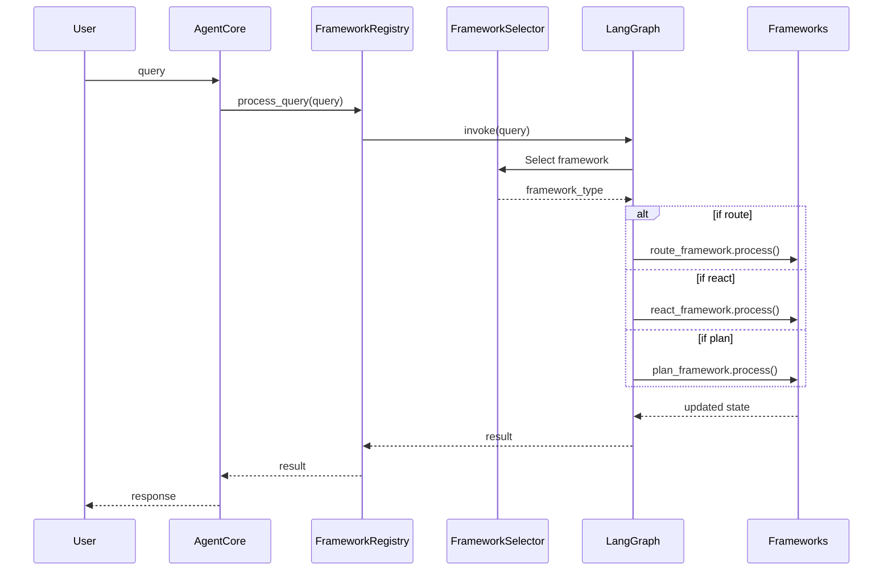

# LangChain and LangGraph Enhanced Framework

This document provides a summary of the enhanced agent framework implementation that uses LangChain components and LangGraph for orchestration.

## Overview

The enhanced architecture introduces a sophisticated agent framework system built on LangChain and LangGraph where:

1. Agent frameworks are implemented using LangChain components
2. High-level orchestration is handled by LangGraph
3. All components are deployable via configuration files

This integration provides greater flexibility, modularity, and extensibility while leveraging the power of established libraries.

## Key Components

### 1. LangChain-Based Frameworks

The system includes several agent frameworks implemented using LangChain:

```python
BaseLCAgentFramework          # Base framework class
├── LCRouteAgentFramework     # Routes to specialized agents
├── LCReactAgentFramework     # Implements ReAct paradigm
└── LCPlanAgentFramework      # Creates and executes plans
```

These frameworks leverage LangChain's components:
- `ChatPromptTemplate` for structured prompt creation
- LangChain's chains and output parsers
- LangChain's tools system for consistent action interfaces  
- LangChain's agent executors for reliable execution patterns

### 2. LangGraph Orchestration

LangGraph provides a flexible graph-based orchestration system:

```python
LangGraphOrchestrator              # Main orchestration class
├── register_framework()           # Registers frameworks as nodes
├── build_graph()                  # Builds the StateGraph
└── invoke()                       # Processes queries through the graph
```

The orchestrator creates a StateGraph with:
- Framework nodes (route, react, plan)
- Conditional edges based on configuration
- Framework selection as the entry point
- State management across the execution flow

### 3. Framework Registry

The FrameworkRegistry manages framework types and instances:

```python
FrameworkRegistry                 # Registry for agent frameworks
├── register_framework_type()     # Registers a framework type
├── load_from_config()            # Loads frameworks from configuration
└── process_query()               # Processes queries through the graph
```

### 4. Framework Selector

The FrameworkSelector uses LangChain components to determine which framework to use:

```python
FrameworkSelector                 # Selects appropriate framework
├── select_framework()            # Determines framework based on query
└── __call__()                    # Implements node interface for graph
```

The selector analyzes query characteristics to choose between:
- Route framework for simple categorizable queries
- React framework for reasoning and action problems
- Plan framework for complex multi-step problems
- Direct LLM for simple informational questions

### 5. Configuration System

The system is fully configurable through YAML:

```yaml
agent_frameworks:
  - name: route_framework
    type: route
    enabled: true
    config:
      system_prompt: "..."
  
  - name: react_framework
    type: react
    enabled: true
    config:
      system_prompt: "..."
      max_iterations: 10

graph:
  entry_point: framework_selector
  edges:
    - from: framework_selector
      to: route_framework
      condition: "state.agent_outputs.get('framework_selector', {}).get('framework_type') == 'route'"
```

## Query Processing Flow



## Implementation Details

### LangChain Integration

Each framework uses LangChain components:

- **Route Framework**: Uses `ChatPromptTemplate` and chains for routing decisions
- **React Framework**: Uses LangChain's `create_react_agent` and `AgentExecutor`
- **Plan Framework**: Implements multi-step planning and execution with LangChain chains

### LangGraph Integration

The system uses LangGraph for orchestration:

- Defines a graph with framework nodes
- Uses conditional edges for routing
- Manages state transitions between components
- Handles error conditions and fallbacks

### Key Files

1. **New Files:**
   - `ironbox/ironbox/core/langchain_frameworks.py` - LangChain framework implementations
   - `ironbox/ironbox/core/framework_selector.py` - Framework selection logic
   - `ironbox/docs/langchain_langgraph_architecture.md` - Documentation
   - `ironbox/examples/use_langchain_framework.py` - Example usage
   - `ironbox/tests/test_langgraph_framework.py` - Tests

2. **Updated Files:**
   - `ironbox/ironbox/core/agent_core.py` - Updated to use LangChain frameworks
   - `ironbox/ironbox/config.py` - Added framework configuration
   - `ironbox/config.yaml.example` - Updated with framework configuration

## Key Benefits

1. **Modularity**: Frameworks have clear responsibilities and interfaces
2. **Configurability**: All aspects configurable without code changes
3. **Extensibility**: New frameworks can be added through configuration 
4. **Reliability**: Based on established LangChain and LangGraph libraries
5. **Performance**: Efficient state management and error handling
6. **Testability**: Easy to test individual components

## Example Usage

```python
# Initialize agent core
agent_core = AgentCore(config=config)
await agent_core.initialize()

# Process query through LangChain and LangGraph
result = await agent_core.process_query("Help me analyze my cluster health")
print(result["response"])
```

## Testing

Testing can be done using the provided test scripts:

```bash
pytest ironbox/tests/test_langgraph_framework.py
```

These tests validate:
- Framework registry functionality
- Framework selection logic
- Query processing
- Graph flow

## Conclusion

The enhanced architecture with LangChain and LangGraph provides a flexible, powerful, and configurable system for agent frameworks. It combines the best of established libraries with custom orchestration capabilities, making the system both powerful and maintainable.
