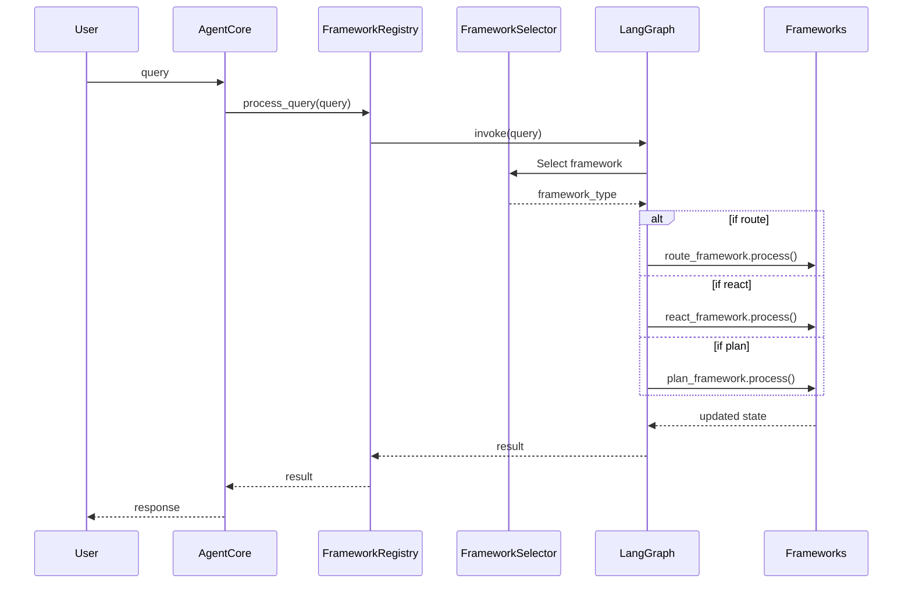

# LangChain and LangGraph Integration Architecture

This document provides an overview of the enhanced agent framework architecture that uses LangChain components and LangGraph for AI orchestration.

## Overview

The enhanced architecture introduces a configurable agent framework system where:

1. Agent frameworks are based on LangChain components
2. Framework orchestration is handled by LangGraph
3. All components are deployable via configuration

This approach provides greater flexibility and extensibility while leveraging the power of established libraries.

## Key Components

### 1. LangChain-Based Frameworks

The system includes several agent frameworks implemented using LangChain:

```python
BaseLCAgentFramework          # Base framework class
├── LCRouteAgentFramework     # Routes to specialized agents
├── LCReactAgentFramework     # Implements ReAct paradigm
└── LCPlanAgentFramework      # Creates and executes plans
```

These frameworks leverage LangChain's components:
- `ChatPromptTemplate` and message placeholders
- LangChain's chains and output parsers
- LangChain's tool system
- LangChain's agent types and executors

### 2. LangGraph Orchestration

LangGraph provides a flexible graph-based orchestration system:

```python
LangGraphOrchestrator              # Main orchestration class
├── register_framework()           # Registers frameworks as nodes
├── build_graph()                  # Builds the StateGraph
└── invoke()                       # Processes queries through the graph
```

The orchestrator creates a graph with:
- Framework nodes (route, react, plan)
- Conditional edges based on configuration
- Framework selection as the entry point

### 3. Framework Registry

A central registry manages framework types and instances:

```python
FrameworkRegistry                 # Registry for agent frameworks
├── register_framework_type()     # Registers a framework type
├── load_from_config()            # Loads frameworks from configuration
└── process_query()               # Processes a query through the graph
```

### 4. Framework Selector

A LangChain-based framework selector determines which framework to use:

```python
FrameworkSelector                 # Selects the appropriate framework
├── select_framework()            # Determines framework based on query
└── __call__()                    # Implements node interface for graph
```

### 5. Configuration System

The system is fully configurable through YAML:

```yaml
agent_frameworks:
  - name: route_framework
    type: route
    enabled: true
    config:
      system_prompt: "..."
  
  - name: react_framework
    type: react
    enabled: true
    config:
      system_prompt: "..."
      max_iterations: 10

graph:
  entry_point: framework_selector
  edges:
    - from: framework_selector
      to: route_framework
      condition: "..."
```

## Query Processing Flow



## Benefits of the Enhanced Architecture

1. **Modularity**: Each component has a clear responsibility
2. **Configurability**: All aspects can be configured without code changes
3. **Extensibility**: New frameworks can be added through configuration
4. **Performance**: LangGraph provides efficient state management and routing
5. **Maintainability**: Clear separation of concerns
6. **Reusability**: Components can be reused across different contexts

## Implementation Details

### LangChain-based Framework Implementation

Each framework uses LangChain components for its core functionality:

- **Route Framework**: Uses `ChatPromptTemplate` and a chain for routing decisions
- **React Framework**: Uses LangChain's `create_react_agent` and `AgentExecutor`
- **Plan Framework**: Implements a multi-step plan and execute pattern

### LangGraph Orchestration

The graph is built dynamically based on configuration:

1. Framework nodes are registered with the graph
2. Edges are created based on conditional routing rules
3. The framework selector is set as the entry point
4. The graph is compiled for efficient execution

### Framework Selection

The selector uses a simple LLM-based approach:

1. Query is analyzed by the LLM
2. Framework type is determined based on query characteristics
3. Selection is passed to the graph for routing

### Configuration

The configuration system supports:

1. Definition of framework types and instances
2. Specification of prompts and parameters
3. Conditional routing rules
4. Integration with existing tools and agents

## Extending the System

New frameworks can be added by:

1. Creating a new class derived from `BaseLCAgentFramework`
2. Registering it with the `FrameworkRegistry`
3. Adding it to the configuration

## Testing

The system includes comprehensive tests:

1. Unit tests for individual components
2. Integration tests for the orchestration flow
3. End-to-end tests for query processing

## Conclusion

The enhanced architecture provides a flexible, powerful, and configurable system for agent frameworks. By leveraging LangChain and LangGraph, it combines the best of established libraries with a custom orchestration layer.
