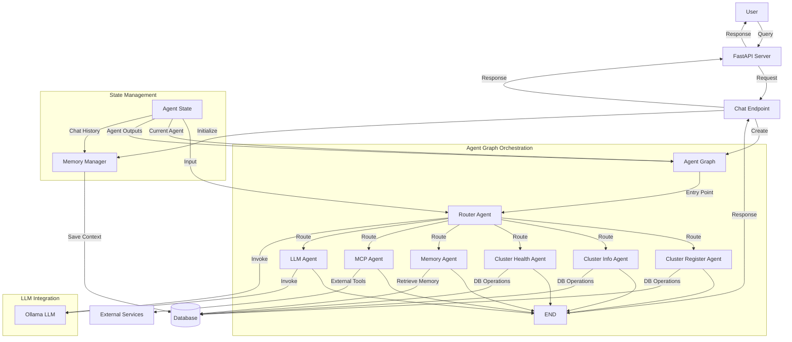

# Multi-Agent Architecture Q&A

This document contains questions and answers about the multi-agent architecture used in IronBox.

## What multi-agent architecture does this project use?

IronBox uses a directed graph-based multi-agent architecture implemented with LangGraph. Here's a breakdown of the architecture:

### Core Architecture Components

1. **Agent Graph System**:
   - Uses `StateGraph` from LangGraph to orchestrate multiple specialized agents
   - Implements a directed graph where agents are nodes and the flow between them is managed by conditional edges
   - The system maintains state through the `AgentState` class which tracks inputs, outputs, and execution context

2. **Router-Based Dispatch**:
   - A central `RouterAgent` acts as the entry point for all user queries
   - The router analyzes user input and determines which specialized agent should handle the request
   - Routing decisions are made using LLM-based classification of the user's intent

3. **Specialized Agents**:
   - `ClusterRegisterAgent`: Handles Kubernetes cluster registration
   - `ClusterInfoAgent`: Provides information about registered clusters
   - `ClusterHealthAgent`: Monitors and reports on cluster health
   - `MemoryAgent`: Retrieves information from conversation history
   - `MCPAgent`: Interfaces with Model Context Protocol tools
   - `LLMAgent`: Handles general queries that don't match specialized domains

4. **State Management**:
   - The `AgentState` class maintains conversation context, agent outputs, and execution tracking
   - Prevents infinite loops through execution count tracking
   - Preserves session information across interactions

5. **Memory System**:
   - Conversation history is maintained through a `MemoryManager`
   - Enables context-aware responses across multiple interactions

The architecture follows a hub-and-spoke model where the router agent acts as the hub, directing traffic to specialized agents (the spokes) based on the nature of the user's query. This allows for both specialized domain expertise and the ability to handle general queries through the LLM agent.

## Architecture Diagram



This diagram illustrates the flow of information through the IronBox system:

1. **User Interaction Layer**:
   - User sends a query to the FastAPI server
   - The chat endpoint processes the request

2. **Orchestration Layer**:
   - Agent Graph manages the flow between specialized agents
   - Router Agent analyzes the query and determines which specialized agent to invoke
   - Each specialized agent performs its specific task and returns control to the graph

3. **State & Memory Management**:
   - Agent State tracks the current execution context
   - Memory Manager persists conversation history

4. **External Integration**:
   - Database stores cluster information and conversation history
   - MCP Agent connects to external services via Model Context Protocol

5. **LLM Integration**:
   - Ollama LLM provides the intelligence for the Router Agent and LLM Agent
   - LLM Agent handles general queries that don't match specialized domains

The hub-and-spoke design allows for modular expansion - new specialized agents can be added to the system without modifying the core architecture. The Router Agent will automatically consider new agents in its routing decisions based on its system prompt.

## How does the agent state work?

The Agent State is a critical component of the IronBox architecture that maintains context and facilitates communication between agents. It's implemented as a Pydantic `BaseModel` class called `AgentState` in the `graph.py` file.

### Structure and Components

The `AgentState` class contains several key fields:

```python
class AgentState(BaseModel):
    # Input from user
    input: str = Field(default="")
    
    # Chat history
    chat_history: List[Dict[str, str]] = Field(default_factory=list)
    
    # Current agent
    current_agent: Optional[str] = Field(default=None)
    
    # Agent outputs
    agent_outputs: Dict[str, Any] = Field(default_factory=dict)
    
    # Final response
    response: Optional[str] = Field(default=None)
    
    # Error information
    error: Optional[str] = Field(default=None)
    
    # Session ID
    session_id: Optional[str] = Field(default=None)
    
    # Execution count to prevent infinite loops
    execution_count: Dict[str, int] = Field(default_factory=dict)
```

### How Agent State Works

1. **Initialization**: When a user sends a query, a new `AgentState` instance is created with:
   - The user's input text
   - A session ID for tracking the conversation
   - Empty containers for tracking agent outputs and execution

2. **State Passing**: This state object is passed between agents as they process the request:
   - Each agent receives the state
   - Modifies it (adding outputs, updating current agent)
   - Returns the updated state

3. **Agent Output Collection**: As each agent processes the request, it adds its output to the `agent_outputs` dictionary:
   ```python
   state.agent_outputs[agent_name] = {
       "response": response_text,
       "next": next_agent,  # For router agent
   }
   ```

4. **Execution Tracking**: The state tracks how many times each agent has been called to prevent infinite loops:
   ```python
   # In _route_from_router method
   if next_agent not in state.execution_count:
       state.execution_count[next_agent] = 0
   
   state.execution_count[next_agent] += 1
   
   if state.execution_count[next_agent] > 1:
       logger.warning(f"Execution count for {next_agent} exceeded limit. Ending graph.")
       return END
   ```

5. **Error Handling**: If an agent encounters an error, it can record it in the state:
   ```python
   state.error = f"Agent error: {str(e)}"
   ```

6. **Response Extraction**: After all agents have processed the request, the final response is extracted from the state:
   - First checking for a direct response field
   - Then looking for responses in agent outputs
   - Prioritizing certain agents (like cluster_health)

### Flow Through the System

1. **Initial Creation**: Created in the `invoke` method of `AgentGraph`
2. **Router Processing**: First passed to the Router Agent
3. **Specialized Agent**: Then to the appropriate specialized agent based on routing
4. **Response Extraction**: Finally processed to extract the response

### Benefits of this Approach

1. **Shared Context**: All agents have access to the same context
2. **Stateful Processing**: Maintains state across the entire processing pipeline
3. **Safety Mechanisms**: Prevents infinite loops and tracks errors
4. **Flexible Response Handling**: Can extract responses from different sources based on priority

The Agent State acts as both a communication channel between agents and a persistent memory of the current processing context, enabling the coordinated behavior of the multi-agent system.

## How does the router agent use the state to make decisions?

The Router Agent is the central decision-maker in the IronBox architecture, determining which specialized agent should handle each user query. Here's a detailed look at how it uses the AgentState to make these routing decisions:

### 1. Input Extraction and Context Building

When the Router Agent is called, it first extracts relevant information from the AgentState:

```python
async def __call__(self, state: AgentState) -> AgentState:
    try:
        logger.debug("RouterAgent called with input: %s", state.input)
        
        # Prepare messages for LLM
        messages = [
            {"role": "system", "content": self.system_prompt},
            {"role": "user", "content": state.input},
        ]
        
        # Add chat history for context
        for message in state.chat_history[-5:]:  # Last 5 messages
            messages.append(message)
```

The Router Agent:
- Extracts the user's input query from `state.input`
- Includes up to 5 recent messages from `state.chat_history` to provide conversation context
- Combines this with its system prompt that defines the available agents and their capabilities

### 2. LLM-Based Classification

The Router Agent then uses an LLM to analyze the query and determine which specialized agent is most appropriate:

```python
# Get response from LLM
logger.debug("Calling LLM with messages: %s", messages)
response = await self.llm.ainvoke(messages)
logger.debug("LLM response: %s", response)

# Extract response text
if hasattr(response, 'generations'):
    # ChatResult object
    response_text = response.generations[0].message.content
elif isinstance(response, AIMessage):
    # AIMessage object
    response_text = response.content
else:
    # Fallback
    response_text = str(response)
```

The LLM acts as a classifier, analyzing the user's query against the capabilities of each agent described in the system prompt.

### 3. Routing Decision

Based on the LLM's analysis, the Router Agent determines which specialized agent should handle the request:

```python
# Determine next agent
next_agent = None
if "cluster_register" in response_text.lower():
    next_agent = AgentType.CLUSTER_REGISTER
elif "cluster_info" in response_text.lower():
    next_agent = AgentType.CLUSTER_INFO
elif "cluster_health" in response_text.lower():
    next_agent = AgentType.CLUSTER_HEALTH
elif "memory" in response_text.lower():
    next_agent = AgentType.MEMORY
elif "mcp" in response_text.lower():
    next_agent = AgentType.MCP
elif "llm" in response_text.lower():
    next_agent = AgentType.LLM
```

This simple keyword-based extraction identifies which agent the LLM has determined is most appropriate.

### 4. State Update

The Router Agent then updates the AgentState with its decision:

```python
# Update state
state.current_agent = AgentType.ROUTER
state.agent_outputs[AgentType.ROUTER] = {
    "response": response_text,
    "next": next_agent,
}

return state
```

It sets:
- `current_agent` to indicate it's currently the active agent
- `agent_outputs[AgentType.ROUTER]` to store both:
  - The full response from the LLM (for debugging/transparency)
  - The `next` field that indicates which agent should handle the request

### 5. Graph-Level Routing

After the Router Agent returns the updated state, the Agent Graph uses this information to determine the next step:

```python
def _route_from_router(self, state: AgentState) -> str:
    # Get the next agent from router output
    agent_outputs = state.agent_outputs
    if AgentType.ROUTER not in agent_outputs:
        return END
    
    router_output = agent_outputs[AgentType.ROUTER]
    next_agent = router_output.get("next")
    
    # Check if next agent is valid
    if next_agent and next_agent in self.agents:
        # Track execution count to prevent infinite loops
        if next_agent not in state.execution_count:
            state.execution_count[next_agent] = 0
        
        # Increment execution count
        state.execution_count[next_agent] += 1
        
        # If execution count exceeds limit, end the graph
        if state.execution_count[next_agent] > 1:
            logger.warning(f"Execution count for {next_agent} exceeded limit. Ending graph.")
            return END
        
        return next_agent
    
    # If no valid next agent, end the graph
    return END
```

This method:
- Extracts the `next` field from the Router Agent's output
- Validates that the specified agent exists
- Implements safety checks to prevent infinite loops
- Returns the name of the next agent to execute, or END if processing should stop

### Key Aspects of the Router's Decision-Making

1. **LLM-Powered Classification**: Uses an LLM to understand user intent rather than rigid rules
2. **Contextual Awareness**: Incorporates conversation history for better understanding
3. **Explicit Routing**: Clearly indicates the next agent in the state
4. **Safety Mechanisms**: Works with the graph to prevent infinite loops
5. **Fallback Handling**: If no specialized agent is appropriate, routes to the general LLM agent

This approach combines the flexibility of LLM-based classification with the structure of a directed graph, allowing the system to intelligently route queries while maintaining control over the execution flow.

## Where is LangGraph used?

LangGraph is a core component of the IronBox architecture, used to orchestrate the multi-agent system. Looking at the codebase and requirements, IronBox uses LangGraph version 0.0.20 or higher.

### Where LangGraph is Used

LangGraph is primarily implemented in the `ironbox/core/graph.py` file, where it provides the foundation for the agent orchestration system. Here are the specific LangGraph components used:

```python
from langgraph.graph import StateGraph, END
from langgraph.prebuilt import ToolNode
```

### Key LangGraph Components

1. **StateGraph**: The central orchestration mechanism that:
   - Defines the structure of the agent graph
   - Manages the flow of execution between agents
   - Handles state transitions

2. **END**: A special node marker that indicates the termination of graph execution

3. **ToolNode**: A utility for integrating tools into the graph (imported but not directly used in the current implementation)

### Graph Construction

The `_build_graph` method in the `AgentGraph` class shows how LangGraph is used to construct the agent network:

```python
def _build_graph(self) -> StateGraph:
    """
    Build the agent graph.
    
    Returns:
        StateGraph instance
    """
    # Create the graph
    graph = StateGraph(AgentState)
    
    # Add nodes for each agent
    for agent_name, agent in self.agents.items():
        graph.add_node(agent_name, agent)
    
    # Add router as the entry point
    graph.set_entry_point(AgentType.ROUTER)
    
    # Define conditional routing
    graph.add_conditional_edges(
        AgentType.ROUTER,
        self._route_from_router,
    )
    
    # Add edges from other agents to END
    for agent_name in self.agents.keys():
        if agent_name != AgentType.ROUTER:
            # All non-router agents go directly to END
            graph.add_edge(agent_name, END)
    
    # Compile the graph
    return graph.compile()
```

### Flow Control with LangGraph

The system uses LangGraph's conditional routing to determine which agent should handle each request:

1. The `add_conditional_edges` method connects the Router agent to other agents based on the routing decision
2. The `_route_from_router` method extracts the next agent from the state and returns it
3. LangGraph then routes execution to that agent
4. After the specialized agent completes, execution flows to the END node

### Graph Execution

The `invoke` method in `AgentGraph` shows how the LangGraph execution is triggered:

```python
async def invoke(self, input_text: str, session_id: Optional[str] = None) -> Dict[str, Any]:
    # Create initial state with session_id
    state = AgentState(input=input_text, session_id=session_id)
    
    # Run the graph
    result = await self.graph.ainvoke(state)
    
    # Process and return results...
```

The `graph.ainvoke(state)` call is where LangGraph takes control, managing the flow of execution through the agent network according to the defined graph structure and routing logic.

### LangGraph Architecture Pattern

IronBox uses a hub-and-spoke pattern with LangGraph:
- The Router agent is the hub
- Specialized agents are the spokes
- Conditional routing determines which spoke to activate
- All spokes return to END after completion

This pattern allows for modular expansion of the system - new agents can be added without modifying the core graph structure, as the Router agent's LLM-based classification will automatically incorporate them into the routing decisions.

LangGraph provides the orchestration layer that enables this flexible, state-based agent coordination system while maintaining control over the execution flow and ensuring proper state management throughout the process.
