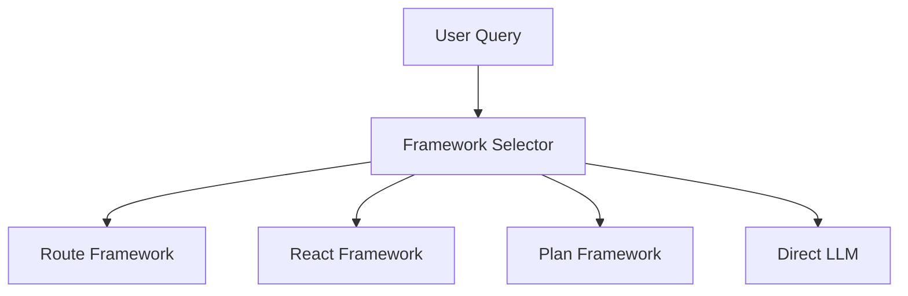
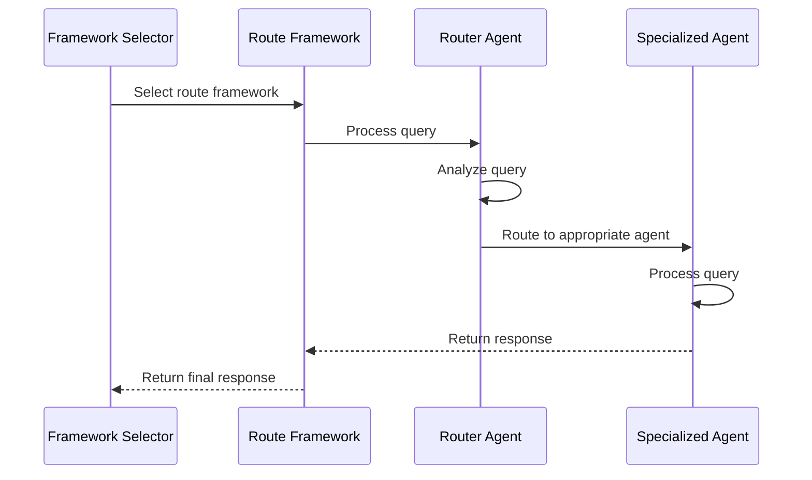

# Toolkit and Agent Framework Q&A

This document contains questions and answers about the toolkit system and agent framework in IronBox.

## Question 1: How does the toolkit system work?

The toolkit system in IronBox is a central component that manages and organizes different types of tools and agents, providing a unified interface for agent frameworks to access and use them.

### Core Components

#### 1. Toolkit Class

The `Toolkit` class (in `ironbox/core/toolkit.py`) is the main implementation that:
- Maintains collections of tools and agents
- Categorizes tools by type (local, MCP, agent)
- Provides methods for registering and retrieving tools and agents
- Supports loading from configuration and auto-discovery

#### 2. Tool Types

The toolkit manages three main types of tools:

**Local Tools**: Python functions defined within the application that perform specific operations.
```python
def get_pod_count(namespace: str) -> int:
    """Get the number of pods in a namespace."""
    # Implementation...
    return count
```

**MCP Tools**: External tools accessed through the Model Context Protocol (MCP) client, connecting to external MCP servers.
```python
# These are wrapped as Python functions but actually call external services
async def mcp_weather_get_current_weather(city: str) -> dict:
    """Get current weather for a city."""
    # Implementation calls MCP client...
    return weather_data
```

**Agent Tools**: Specialized agents wrapped as tools, allowing them to be used by other frameworks.
```python
# These are wrapper functions that invoke specialized agents
async def agent_cluster_health(query: str) -> str:
    """Execute the cluster_health agent with the given query."""
    # Implementation creates a state and calls the agent...
    return response
```

For more details, see [Toolkit System Explanation](toolkit_system_explanation.md).

## Question 2: How are agents invoked in the framework?

The IronBox system uses a sophisticated architecture for invoking agents within different frameworks.

### Framework Selection Process

When a query enters the system, it first goes through the **Framework Selector**:



The Framework Selector analyzes the query and determines which framework is most appropriate:
- **Route Framework**: For simple, categorizable queries matching a specific agent's expertise
- **React Framework**: For multi-step problems requiring reasoning and tool usage
- **Plan Framework**: For complex problems requiring structured planning
- **Direct LLM**: For simple informational queries not requiring tools

### Agent Invocation in Each Framework

#### Route Framework



1. The Route Framework receives the query from the Framework Selector
2. It uses a Router Agent to analyze the query and determine which specialized agent should handle it
3. The appropriate specialized agent (e.g., ClusterInfoAgent, MemoryAgent) is invoked with the query
4. The specialized agent processes the query and returns a response
5. The response is returned through the framework

For more details, see [Agent Invocation Explanation](agent_invocation_explanation.md).
