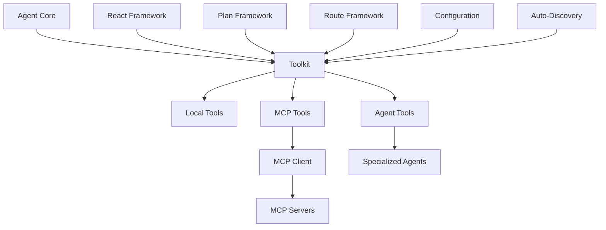
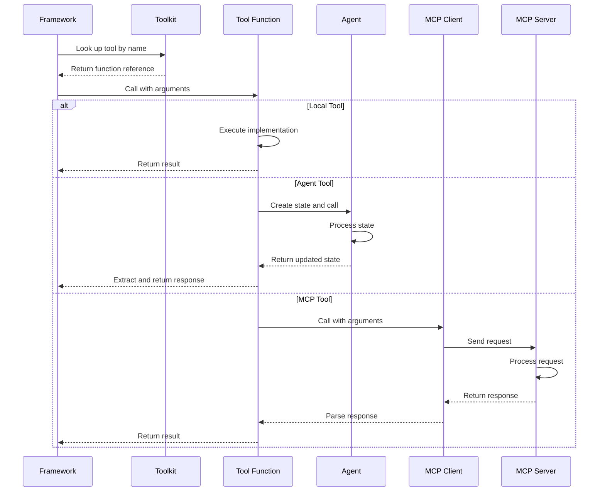

# The Toolkit System in IronBox

The toolkit system in IronBox is a central component that manages and organizes different types of tools and agents, providing a unified interface for agent frameworks to access and use them. Here's a comprehensive explanation of how it works:

## Core Components

### 1. Toolkit Class

The `Toolkit` class (in `ironbox/core/toolkit.py`) is the main implementation that:
- Maintains collections of tools and agents
- Categorizes tools by type (local, MCP, agent)
- Provides methods for registering and retrieving tools and agents
- Supports loading from configuration and auto-discovery

### 2. Tool Types

The toolkit manages three main types of tools:

**Local Tools**: Python functions defined within the application that perform specific operations.
```python
def get_pod_count(namespace: str) -> int:
    """Get the number of pods in a namespace."""
    # Implementation...
    return count
```

**MCP Tools**: External tools accessed through the Model Context Protocol (MCP) client, connecting to external MCP servers.
```python
# These are wrapped as Python functions but actually call external services
async def mcp_weather_get_current_weather(city: str) -> dict:
    """Get current weather for a city."""
    # Implementation calls MCP client...
    return weather_data
```

**Agent Tools**: Specialized agents wrapped as tools, allowing them to be used by other frameworks.
```python
# These are wrapper functions that invoke specialized agents
async def agent_cluster_health(query: str) -> str:
    """Execute the cluster_health agent with the given query."""
    # Implementation creates a state and calls the agent...
    return response
```

## Registration and Discovery

Tools and agents can be added to the toolkit in three ways:

### 1. Manual Registration

```python
# Register a local tool
agent_core.register_tool("get_pod_count", get_pod_count, "local")

# Register an agent
agent_core.register_agent("cluster_health", ClusterHealthAgent)
```

### 2. Configuration-based Loading

Tools and agents can be defined in the `config.yaml` file:

```yaml
toolkit:
  tools:
    - name: get_pod_count
      module: ironbox.tools.kubernetes
      function: get_pod_count
      description: Get the number of pods in a cluster
      enabled: true
  
  agents:
    - name: cluster_health
      class: ironbox.agents.cluster_health.ClusterHealthAgent
      enabled: true
```

The toolkit loads these definitions during initialization using the `_load_from_config` method.

### 3. Auto-discovery

When enabled, the toolkit can automatically discover and register tools and agents:

```yaml
toolkit:
  discovery:
    tools:
      enabled: true
      paths:
        - ironbox.tools
    agents:
      enabled: true
      paths:
        - ironbox.agents
```

- For tools: It looks for functions with docstrings in specified packages
- For agents: It looks for classes ending with "Agent" and having a `__call__` method

## Agent-as-Tool Wrapping

A key feature is the ability to expose agents as tools:

1. When an agent is registered, the toolkit creates a wrapper function
2. This wrapper function:
   - Takes a query and additional parameters
   - Creates a minimal agent state with these parameters
   - Calls the agent with this state
   - Extracts and returns the response

```python
def _create_agent_tool_wrapper(self, agent_type: str, agent: Callable):
    async def agent_tool_wrapper(query: str, **kwargs):
        # Create state, call agent, extract response...
        return response
    
    agent_tool_wrapper.__name__ = f"agent_{agent_type}"
    agent_tool_wrapper.__doc__ = f"Execute the {agent_type} agent with the given query"
    
    return agent_tool_wrapper
```

## MCP Tool Integration

The toolkit integrates with MCP servers through the `register_mcp_tools` method in `AgentCore`:

1. It connects to MCP servers and lists available tools
2. For each tool, it creates a wrapper function
3. These wrapper functions are registered with the toolkit as MCP tools

```python
def _create_mcp_tool_wrapper(self, server_name: str, tool_name: str, description: Optional[str] = None):
    async def mcp_tool_wrapper(**kwargs):
        # Call MCP client to invoke the tool...
        return result
    
    mcp_tool_wrapper.__name__ = f"mcp_{server_name}_{tool_name}"
    mcp_tool_wrapper.__doc__ = description or f"MCP tool {tool_name} from server {server_name}"
    
    return mcp_tool_wrapper
```

## Integration with Agent Frameworks

The toolkit is used by different agent frameworks:

1. **Route Framework**: Uses agents directly for routing queries to specialized agents
2. **React Framework**: Uses all tools (including agent tools) for step-by-step reasoning and action
3. **Plan Framework**: Uses all tools for planning and executing multi-step tasks

```python
def setup_react_framework(self):
    # Create react framework with all tools (including agent-wrapped tools)
    react_framework = LCReactAgentFramework(llm=self.llm, tools=self.toolkit.tools)
    self.register_framework("react", react_framework)
```

## Tool Invocation Flow

When a tool is invoked:

1. A framework looks up a tool by name in the toolkit
2. The toolkit returns the function reference
3. The framework calls the function with arguments
4. Depending on the tool type:
   - Local tools execute directly
   - Agent tools create a state, call the agent, and extract the response
   - MCP tools call the MCP client, which sends a request to the MCP server

## Benefits of the Unified Toolkit

- **Centralized Management**: Single point of registration and access for all tools and agents
- **Consistent Interface**: Common interface for different types of tools
- **Flexible Configuration**: Tools and agents can be configured through YAML files
- **Auto-discovery**: Automatic discovery of tools and agents based on conventions
- **Agent-as-Tool Wrapping**: Agents can be used as tools by other frameworks
- **MCP Integration**: Seamless integration with external MCP servers

## Visual Representation



This diagram shows how the Toolkit sits at the center of the system, managing different types of tools and providing them to the agent frameworks.

## Tool Invocation Sequence



This sequence diagram illustrates how tools are invoked through the toolkit, with different paths depending on the tool type.
