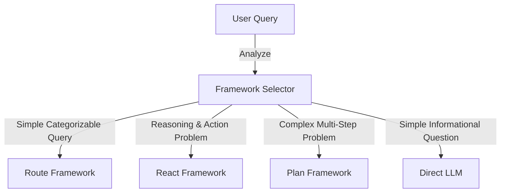
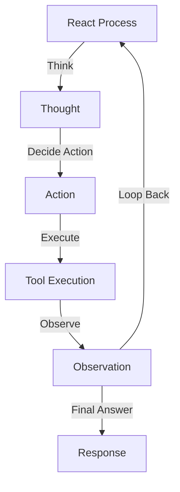
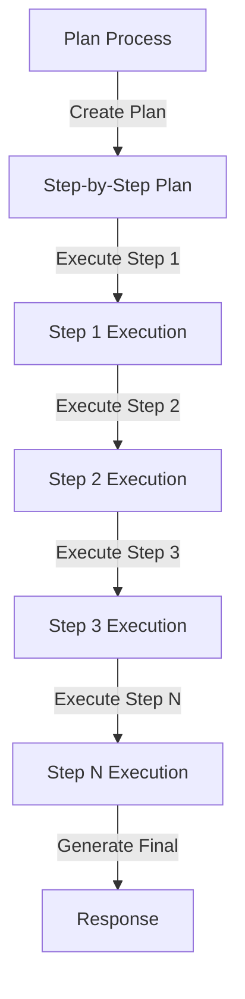
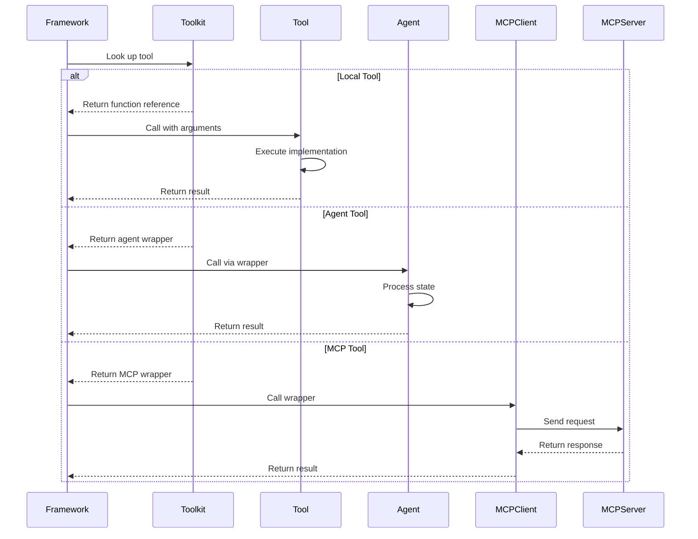
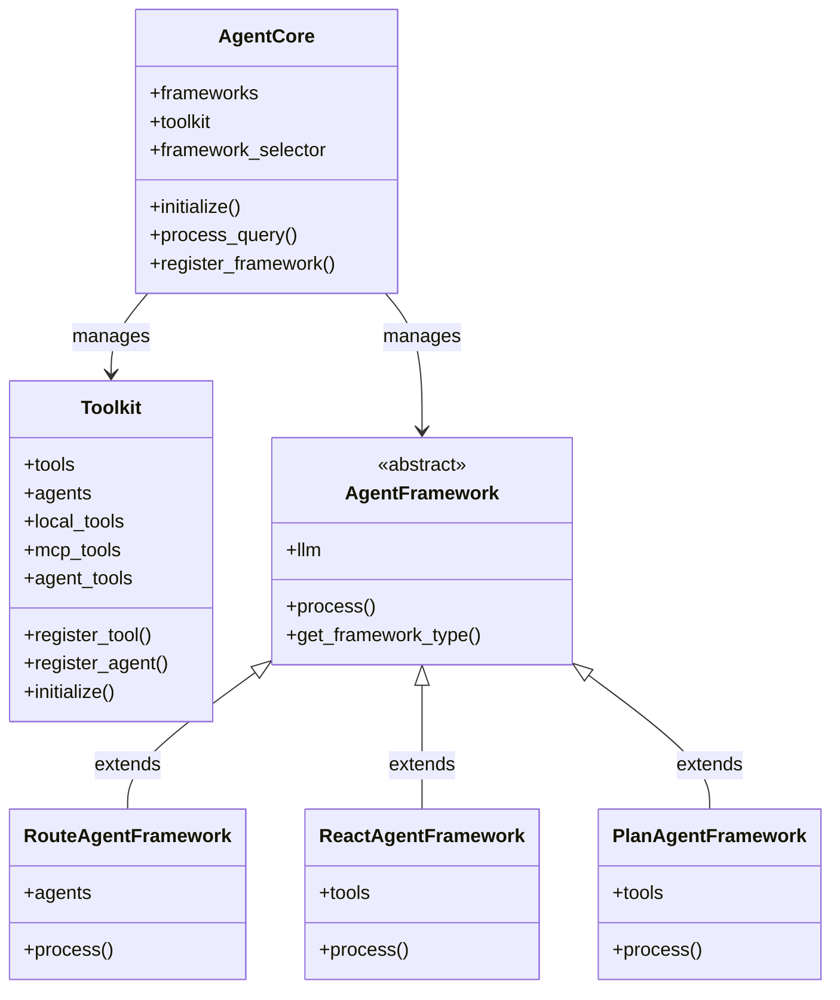
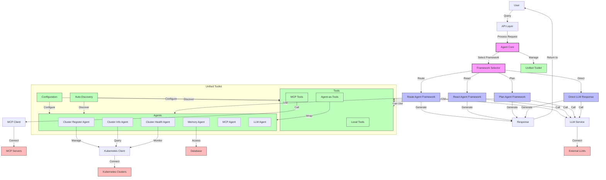
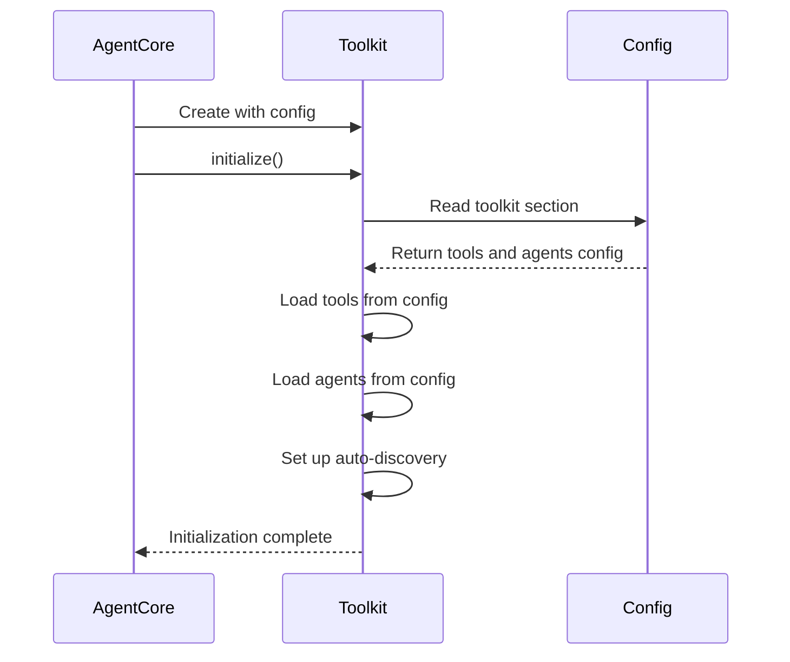
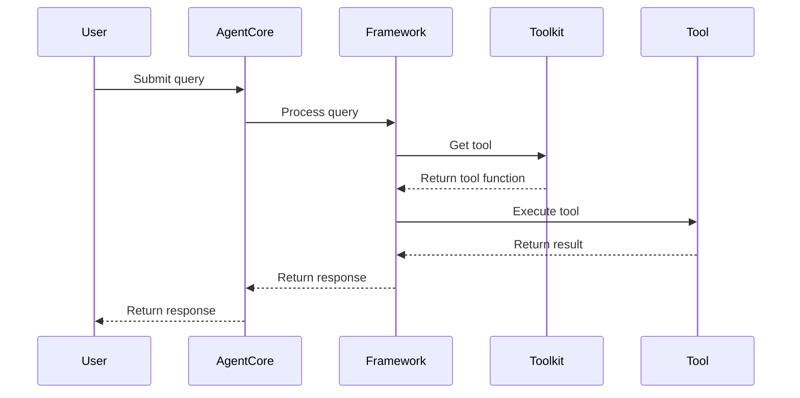
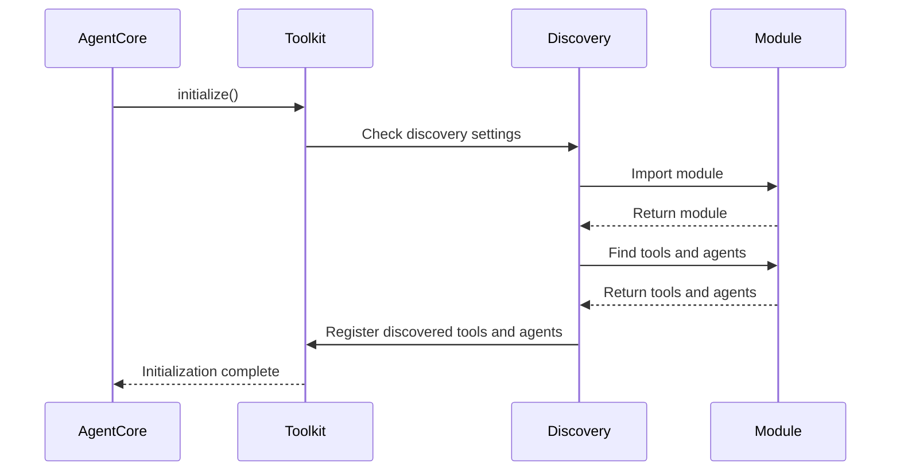

# Unified Toolkit Architecture

This document captures the design and implementation details of the Unified Toolkit architecture in IronBox, including diagrams and explanations of how different components interact.

## Table of Contents

1. [Enhanced Core Framework Design](#enhanced-core-framework-design)
2. [Global Architecture Design](#global-architecture-design)
3. [AgentCore and Toolkit Management](#agentcore-and-toolkit-management)

## Enhanced Core Framework Design

The enhanced core framework introduces a Unified Toolkit that allows all frameworks to access both tools and agents, providing greater flexibility and power.

### Unified Toolkit Integration

```mermaid
graph TD
    User[User] --> |Query| AgentCore[Agent Core]
    AgentCore --> |Analyze Query| FrameworkSelector[Framework Selector]
    FrameworkSelector --> |Select Framework| Frameworks[Agent Frameworks]
    
    subgraph "Unified Toolkit"
        LocalTools[Local Tools]
        MCPTools[MCP Tools]
        AgentTools[Agent-as-Tools]
        SpecializedAgents[Specialized Agents]
        Config[Configuration]
        Discovery[Auto-Discovery]
    end
    
    subgraph "Agent Frameworks"
        RouteFramework[Route Agent Framework]
        ReactFramework[React Agent Framework]
        PlanFramework[Plan Agent Framework]
        DirectLLM[Direct LLM Response]
    end
    
    AgentCore --> |Manages| "Unified Toolkit"
    RouteFramework --> |Use| SpecializedAgents
    RouteFramework --> |Can Also Use| "Unified Toolkit"
    ReactFramework --> |Use| "Unified Toolkit"
    PlanFramework --> |Use| "Unified Toolkit"
    AgentTools --> |Wrap| SpecializedAgents
    Config --> |Configure| "Unified Toolkit"
    Discovery --> |Discover| "Unified Toolkit"
```

### Framework Selection Logic



### React Framework Process



### Plan Framework Process



### Tool Invocation Flow



### Class Hierarchy



## Global Architecture Design

The global architecture shows how all components of the enhanced IronBox system work together:



### System Components Breakdown

1. **User Interface and API Layer**
   - **User**: End-user interacting with the system
   - **API Layer**: Handles HTTP requests and routes them to the Agent Core

2. **Core Components**
   - **Agent Core**: Central orchestrator that manages frameworks and toolkit
   - **Framework Selector**: Analyzes queries and selects the appropriate framework
   - **Unified Toolkit**: Repository for all tools and agents

3. **Agent Frameworks**
   - **Route Agent Framework**: Routes queries to specialized agents
   - **React Agent Framework**: Uses reasoning and action with tools
   - **Plan Agent Framework**: Creates and executes plans with tools
   - **Direct LLM Response**: Bypasses frameworks for simple queries

4. **Toolkit Components**
   - **Tools**:
     - **Local Tools**: Native Python functions
     - **MCP Tools**: External MCP server tools
     - **Agent-as-Tools**: Agents wrapped as tools
   - **Agents**:
     - **Cluster Register Agent**: Registers Kubernetes clusters
     - **Cluster Info Agent**: Provides cluster information
     - **Cluster Health Agent**: Monitors cluster health
     - **Memory Agent**: Manages conversation memory
     - **MCP Agent**: Interfaces with MCP servers
     - **LLM Agent**: Handles general queries
   - **Configuration**: YAML-based configuration system
   - **Auto-Discovery**: Automatic discovery of tools and agents

5. **External Systems**
   - **LLM Service**: Interface to language models
   - **MCP Servers**: External Model Context Protocol servers
   - **Kubernetes Clusters**: Managed Kubernetes environments
   - **Database**: Persistent storage for system data

### Data Flow

1. User submits a query through the API
2. Agent Core receives the query
3. Framework Selector analyzes the query and selects the appropriate framework
4. Selected framework processes the query:
   - Route Framework routes to specialized agents
   - React Framework uses tools in a reasoning loop
   - Plan Framework creates and executes a plan with tools
   - Direct LLM provides a direct response
5. Framework generates a response using tools, agents, and LLM
6. Response is returned to the user

## AgentCore and Toolkit Management

The AgentCore manages the Unified Toolkit through a comprehensive lifecycle that includes initialization, configuration, registration, and provision to frameworks.

### Toolkit Instantiation

The AgentCore creates and maintains an instance of the Toolkit class:

```python
class AgentCore:
    def __init__(self, config=None, llm=None):
        self.config = config or load_config()
        self.llm = llm or default_llm
        self.framework_selector = FrameworkSelector(llm=self.llm)
        self.frameworks = {}
        self.toolkit = Toolkit(config=self.config)  # Unified toolkit instance
        self.mcp_tools_initialized = False
```

The Toolkit is instantiated with the configuration, allowing it to access toolkit-specific settings.

### Initialization Process

The AgentCore has an `initialize()` method that sets up the toolkit:

```python
async def initialize(self):
    """Initialize the agent core."""
    # Initialize the toolkit
    self.toolkit.initialize()
    
    # Register MCP tools
    await self.register_mcp_tools()
    
    # Set up frameworks with the unified toolkit
    self.setup_route_framework()
    self.setup_react_framework()
    self.setup_plan_framework()
    
    logger.debug("Agent core initialized")
```

This method:
1. Calls `toolkit.initialize()` to load tools and agents from configuration
2. Registers MCP tools with the toolkit
3. Sets up frameworks with the toolkit

### Configuration-Based Loading

The AgentCore passes its configuration to the Toolkit, which then loads tools and agents based on the configuration:



The configuration specifies which tools and agents to load:

```yaml
toolkit:
  tools:
    - name: get_pod_count
      module: ironbox.tools.kubernetes
      function: get_pod_count
      enabled: true
  agents:
    - name: cluster_register
      class: ironbox.agents.cluster_register.ClusterRegisterAgent
      enabled: true
```

### Tool and Agent Registration

The AgentCore provides methods to register tools and agents with the toolkit:

```python
def register_tool(self, tool_name: str, tool_func: Callable, tool_type: str = "local"):
    """Register a tool in the toolkit."""
    self.toolkit.register_tool(tool_name, tool_func, tool_type)

def register_agent(self, agent_type: str, agent: Callable):
    """Register an agent in the toolkit."""
    self.toolkit.register_agent(agent_type, agent)
```

These methods delegate to the corresponding methods in the Toolkit class.

### MCP Tool Registration

The AgentCore has a special method to register MCP tools:

```python
async def register_mcp_tools(self):
    """Register MCP tools with the agent core."""
    if self.mcp_tools_initialized:
        return
    
    try:
        # Initialize MCP client
        await default_mcp_client.initialize()
        
        # Get list of servers
        servers = await default_mcp_client.list_servers()
        
        for server in servers:
            server_name = server.get("name")
            if not server_name:
                continue
            
            # Get tools for this server
            tools = await default_mcp_client.list_tools(server_name)
            
            for tool in tools:
                tool_name = tool.get("name")
                if not tool_name:
                    continue
                
                # Create a wrapper function for this tool
                tool_wrapper = self._create_mcp_tool_wrapper(server_name, tool_name, tool.get("description"))
                
                # Register the wrapper
                registered_name = f"mcp_{server_name}_{tool_name}"
                self.register_tool(registered_name, tool_wrapper, "mcp")
        
        self.mcp_tools_initialized = True
    except Exception as e:
        logger.error(f"Error registering MCP tools: {e}")
```

This method:
1. Initializes the MCP client
2. Gets a list of available MCP servers
3. For each server, gets a list of available tools
4. Creates a wrapper function for each tool
5. Registers the wrapper with the toolkit

### Framework Setup

The AgentCore sets up each framework with the appropriate components from the toolkit:

```python
def setup_route_framework(self):
    """Set up the route framework with registered agents."""
    if not self.toolkit.agents:
        logger.warning("No agents registered for route framework")
        return
    
    # Create route framework with registered agents
    route_framework = RouteAgentFramework(llm=self.llm, agents=self.toolkit.agents)
    self.register_framework("route", route_framework)

def setup_react_framework(self):
    """Set up the react framework with the unified toolkit."""
    if not self.toolkit.tools:
        logger.warning("No tools registered for react framework")
        return
    
    # Create react framework with all tools (including agent-wrapped tools)
    react_framework = ReactAgentFramework(llm=self.llm, tools=self.toolkit.tools)
    self.register_framework("react", react_framework)

def setup_plan_framework(self):
    """Set up the plan framework with the unified toolkit."""
    if not self.toolkit.tools:
        logger.warning("No tools registered for plan framework")
        return
    
    # Create plan framework with all tools (including agent-wrapped tools)
    plan_framework = PlanAgentFramework(llm=self.llm, tools=self.toolkit.tools)
    self.register_framework("plan", plan_framework)
```

These methods:
1. Check if the necessary components are available
2. Create the framework with the appropriate components
3. Register the framework with the AgentCore

### Toolkit Access Flow

When processing a query, the AgentCore provides the frameworks with access to the toolkit:



### Dynamic Tool Discovery

The AgentCore can also discover tools and agents dynamically through the toolkit's auto-discovery mechanism:



This allows the system to be extended with new tools and agents without modifying the core code.

### Summary

The AgentCore manages the Unified Toolkit through:

1. **Initialization**: Creating and initializing the toolkit
2. **Configuration**: Loading tools and agents from configuration
3. **Registration**: Providing methods to register tools and agents
4. **MCP Integration**: Registering MCP tools with the toolkit
5. **Framework Setup**: Setting up frameworks with toolkit components
6. **Access Provision**: Providing frameworks with access to the toolkit
7. **Discovery**: Supporting dynamic discovery of tools and agents

This comprehensive management approach ensures that all components of the system have access to the tools and agents they need, while maintaining a clean separation of concerns between the AgentCore, the Toolkit, and the Frameworks.
